# Nodejs编程

> 西岭老湿
>
> 传智播客 & 黑马程序员

---

## 第0章 Node介绍

### 0.0 回顾 JavaScript 

+ **历史及发展 **

  1995年 网景公司的布兰登开发；

  1997年7月，ECMA组织发布ECMAScript 1.0版;

  2007年10月发布3.1版本后不久，ECMAScript 3.1改名为 ECMAScript 5。

  2008年，为Chrome浏览器而开发的V8编译器诞生

  2011年6月，ECMAscript 5.1版发布，现在使用最为广泛的版本;

  2015年6月，ECMAScript 6正式发布，并且更名为“ECMAScript 2015”;

+ **如何学习JavaScript**

  JavaScript 的核心语法部分相当精简，也就是语言本身，只包括两个部分:

  + 基本的语法构造(比如操作符、控制结构、语句)

  + 标准库(就是一系列具有各种功能的对象比如Array、Date、Math等)。


  想要实现其他复杂的操作和效果，都要依靠 **宿主环境** 提供API，目前，已经嵌入 JavaScript 的宿主环境有多种，最常见的环境就是 **浏览器** 和 **操作系统** ;

* **回顾 JavaScript 语法特性**
  * 变量、数据类型、流程控制
  * 函数(基本声明参数，作用域，回调函数)、面向对象(原型，构造函数，this的指向，new的过程)


### 0.1 Node是什么

`Node`  是一个基于` Chrome V8` 引擎的` JavaScript ` 运行环境。  

`Node`  不是一种独立的语言、`Node`不是 `JavaScript ` 框架，

`Node`是一个**除了浏览器之外的、可以让` JavaScript ` 运行的环境**

Node.js 是一个让 JavaScript 运行在服务端的开发平台，是使用 事件驱动， 异步非阻塞I/O，单线程，跨平台的 JS 运行环境；

### 0.2. 为什么要学习 Node

- 打开服务器的黑盒子
- 企业需求
- 大前端必备技能
- 为了更好的学习前端框架

### 0.3. Node 能做什么

[知乎 - Node.js能做什么，该做什么？](https://www.zhihu.com/question/20796866)

- Web 服务器(重点)
- 命令行工具
- 网络爬虫:是一种按照一定的规则，自动地抓取网站信息的程序
- 桌面应用程序开发

### 0.4. 一些资源

1. 文档

   [Node.js 官方文档](https://nodejs.org/en/docs/)
   [Node.js 中文文档（非官方）](http://nodejs.cn/)

2. 书籍

   [深入浅出 Node.js](https://read.douban.com/ebook/12053349/)
   [Node.js 权威指南](https://book.douban.com/subject/25892704/)
   [Node.js 实战](https://book.douban.com/subject/25870705/)
   [Node.js实战（第2季）](https://book.douban.com/subject/26642320/)

3. github资源

   [Node.js 包教不包会](https://github.com/alsotang/node-lessons)
   [ECMAScript 6 入门](http://es6.ruanyifeng.com/)
   [七天学会 NodeJS](https://github.com/nqdeng/7-days-nodejs) 

4. 社区

   **[Node.js 中文社区](https://cnodejs.org/)** 

### 0.5. Node 发展历史

[聊聊 Node.js 的历史](https://gitbook.cn/books/58e796fd09012f0a48761eae/index.html)
[来自朴灵大大的 -- Node.js 简史](https://cnodejs.org/topic/555d3d54e684c4c8088a0d78)


## 第1章 NodeJS起步

### 1.1 下载安装 

+ 下载 https://nodejs.org/zh-cn/download/

- 历史版本：https://nodejs.org/en/download/releases/


windows下安装过程：


对于已经装过的，重新安装就会升级

安装成功后，打开命令行，输入 

node --version 或者 node -v  (显示node的版本号)


表示安装成功


其他平台的安装方式：

https://nodejs.org/zh-cn/download/package-manager/


### 1.2 REPL环境


node中的REPL环境类似于浏览器中的 Console控制台 ，可以做一些代码测试。

按ctrl + 两次c 退出REPL环境

但是, 我们写代码肯定不是在控制台中写,而是写在一个单独的.js文件中.


### 1.3 node运行js代码


### 1.4 Node 中的模块

**浏览器(客户端)中的JS**


**Node中的JS**


## 第2章 核心模块的使用

### 2.1 FS模块

node核心模块之一，用于操作文件；

中文手册 : http://nodejs.cn/api/fs.html

+ 文件读写 

```js
// 引入模块
var fs = require('fs');
// console.log(typeof fs); //object 

// 向文件中写入内容
fs.writeFile('./2.1.txt','itcast',function(cb,cb2){
    // 回调函数 (写入成功后执行的函数)
    console.log(cb);
    console.log(cb2);
})

// 从文件中读取内容
fs.readFile('./2.1.txt','utf8',function(e,d){
    // 回调函数 (读取成功后执行的函数)
    console.log(e);
    console.log(d);
});
```


+ 追加内容

```js
// 引入模块
var fs = require('fs');

// 向文件中追加内容
fs.readFile('./2.1.txt','utf8',function(e,d){
    d+='2344';
    fs.writeFile('./2.1.txt',d,function(e){
        if(e){
            console.log('写入失败')
        }else{
            console.log('写入成功')
        }
    })
});
```


### 2.2 HTTP模块

node核心模块之一，用于搭建HTTP服务器；

中文手册 http://nodejs.cn/api/http.html


#### 2.2.1 开启服务器

```js
// 1. 导入http模块
var http = require('http');

// 2. 使用http这个模块中的createServer()创建一个服务器实例对象
var server = http.createServer();

// 3. 绑定端口号,启动web服务器
server.listen(8000, function() {
    console.log(' 请访问http://localhost:8000');
});

// 4. 为这个服务器实例对象注册 request 请求处理函数
// 请求处理函数function(形参1,形参2){}
// 形参1:request请求对象 获取到当前请求的路径,方法等本次请求的所有信息
// 形参2:response响应对象 发送响应数据
server.on('request', function(request, response) {
    console.log('服务端收到客户端的请求啦!!!');
    // 向客户端页面返回字符串
    response.write("hello node");
    // 结束响应
    response.end();
});
```


因为我们的服务器接受请求处理并响应数据时，并没有指定响应数据的类型，所以出现了乱码；

而在http中，我们可以通过服务器的响应头指定数据类型，在 [http.ServerResponse 类](http://nodejs.cn/api/http.html#http_class_http_serverresponse) 中为我们提供了setHeader 方法：


#### 2.2.2 响应 HTML 页面


但是，我们不能一直将html代码写到服务器的方法中，而是需要建一个xx.html的文件，将html文件中的内容返回给客户端；

2.2.2 .html :

```html
<!DOCTYPE html>
<html lang="en">
<head>
    <meta charset="UTF-8">
    <title>Document</title>
</head>
<body>
    <h1>你好，我是西岭老湿</h1>
    <h2>另外，我还很帅……</h2>
</body>
</html>
```

nodejs代码

```js
var http = require('http');
// 1:引入文件操作模块
var fs = require('fs');
var server = http.createServer();
server.on('request', function(request, response) {
    // 2：读取html文件中的内容
    fs.readFile('./2.2.2.html','utf8',function(error,html_data){
        // 设置响应头
        response.setHeader('Content-Type', 'text/html;charset=utf-8');
        // 将html中的内容响应回客户端，结束响应
        response.end(html_data);
    })
});
```


#### 2.2.3 响应图片

```html
<!DOCTYPE html>
<html lang="en">
<head>
    <meta charset="UTF-8">
    <title>Document</title>
</head>
<body>
    <h1>你好，我是西岭老湿</h1>
    <h2>另外，我还很帅……</h2>
    
</body>
</html>
```


```js
server.on('request', function(request, response) {
    // url 属性返回请求的URL字符串
    var urls = request.url;
    if( urls =='/'){
        fs.readFile('./2.2.2.html','utf8',function(error,html_data){
            // 设置响应头
            response.setHeader('Content-Type', 'text/html;charset=utf-8');
            // 将html中的内容响应回客户端，结束响应
            response.end(html_data);
        })
    }else if(urls.indexOf('jpg')>=0){ // 判断请求图片
        fs.readFile('./img/03.jpg',function(error,html_data){
            response.end(html_data);
        })
    }
}
```


#### 2.2.4 响应其他静态资源

```html
<head>
    <meta charset="UTF-8">
    <title>Document</title>
    <link rel="stylesheet" href="./public/h.css">
</head>
<body>
    <h1>你好，我是西岭老湿</h1>
    <h2>另外，我还很帅……</h2>
    
</body>
<script src="./public/h.js"></script>
</html>
```


```js
server.on('request', function(request, response) {
    // url 属性返回请求的URL字符串
    var urls = request.url;
    if( urls =='/'){
        fs.readFile('./2.2.2.html','utf8',function(error,html_data){
            // 设置响应头
            response.setHeader('Content-Type', 'text/html;charset=utf-8');
            // 将html中的内容响应回客户端，结束响应
            response.end(html_data);
        })
    }else{
        fs.readFile('.'+urls,function(error,html_data){
            response.end(html_data);
        })
    }
});
```


### 2.3 服务器遍历文件及文件夹-案例


模仿Apache服务器，遍历文件及文件，显示时间及大小；

右键另存为，下载页面当作静态页面模板使用；

使用node载入静态页面：


使用ajax技术在页面中发送请求到后台，apache.html

```html
<script>
    var xhr = new XMLHttpRequest();
    xhr.onreadystatechange=function(){
      if(this.readyState == 4){
        console.log(this.responseText);
      }
    }
    xhr.open('get','/file_list');
    xhr.send();
</script>
```


node：

```js
server.on('request', function(request, response) {
    // url 属性返回请求的URL字符串
    var urls = request.url;
    if( urls =='/'){
        fs.readFile('./apache.html','utf8',function(error,html_data){
            // 设置响应头
            response.setHeader('Content-Type', 'text/html;charset=utf-8');
            // 将html中的内容响应回客户端，结束响应
            response.end(html_data);
        })
    }else if(urls == '/file_list'){
        fs.readdir('./','utf8',function(err,files){
            response.end(JSON.stringify(files));
        });
    }else{
        fs.readFile('.'+urls,function(error,html_data){
            response.end(html_data);
        })
    }
});
```

apache.html --> ajax

```js
xhr.onreadystatechange=function(){
    if(this.readyState == 4){
        var data = JSON.parse(this.responseText);
        var htmls = '';
        for(var i = 0;i<data.length;i++){
            htmls+='<tr><td valign="top">';
            htmls+= '</td>';
            htmls+='<td><a href="http://localhost/%e7%ac%94%e8%ae%b0-01.pdf">';
            htmls+= data[i]+'</a> </td>';
            htmls+= '<td align="right">2018-04-26 10:31 </td>';
            htmls+= '<td align="right">3.2M</td><td>&nbsp;</td></tr>';
        }
        var tb = document.getElementsByTagName('tbody')[0];
        tb.innerHTML+=htmls;
    }
}
```

### 2.4 动态展示文件的其他属性

获取文件的其他属性：

```js
var fs = require('fs');
fs.readdir('./','utf8',function(err,files){
    fs.stat(files[0],function(er,st){
        console.log(st.mtime);
        console.log(st.size);
        console.log(st.isFile());
    })
});
```


修改node代码

```js
server.on('request', function (request, response) {
    // url 属性返回请求的URL字符串
    var urls = request.url;
    if (urls == '/') {
        fs.readFile('./apache.html', 'utf8', function (error, html_data) {
            // 设置响应头
            response.setHeader('Content-Type', 'text/html;charset=utf-8');
            // 将html中的内容响应回客户端，结束响应
            response.end(html_data);
        })
    } else if (urls == '/file_list') {
        fs.readdir('./', 'utf8', function (err, files) {
            // response.end(JSON.stringify(files));
            var file_obj = [];
            //  判断条件：声明一个变量，这个变量用来记录两个数据的中数据的长度
            var count = 0;
            for (var i = 0; i < files.length; i++) {
                file_obj[i] = {};
                // 利用自调用匿名函数，保留i的变量值
                (function (i) {
                    fs.stat(files[i], function (er, st) {
                        count ++;
                        file_obj[i].name = files[i];
                        if(st.isFile()){
                            file_obj[i].type = 'file';
                        }else{
                            file_obj[i].type = 'dir';
                        }
                        file_obj[i].mtime = st.mtime;
                        file_obj[i].size = st.size;
                        // 当读取的文件个数与所有文件个数相等时
                        if(count == files.length){
                            response.end(JSON.stringify(file_obj));
                        }
                    })
                    // console.log(file_obj);
                })(i);

                // console.log(files[i]);
            }
        });
    } else {
        fs.readFile('.' + urls, function (error, html_data) {
            response.end(html_data);
        })
    }
});
```

修改 ajax代码

``` js
var xhr = new XMLHttpRequest();
xhr.onreadystatechange=function(){
    if(this.readyState == 4){
        var data = JSON.parse(this.responseText);
        var htmls = '';
        for(var i = 0;i<data.length;i++){
            htmls+='<tr><td valign="top">';
            if(data[i].type == 'file'){
                htmls+= '</td>';
            }else{
                htmls+= '</td>';
            }
            htmls+='<td><a href="">';
            htmls+= data[i].name+'</a> </td>';
            htmls+= '<td align="right">'+ data[i].mtime +'</td>';
            htmls+= '<td align="right">'+ data[i].size +'</td><td>&nbsp;</td></tr>';
        }
        var tb = document.getElementsByTagName('tbody')[0];
        tb.innerHTML+=htmls;
    }
}
xhr.open('get','/file_list');
xhr.send();
```


循环后 i 丢失的问题：


```js

// var arr = ['a', 'b', 'c'];
// for (var i = 0; i < arr.length; i++) {
//     // 模拟延迟
//     setTimeout(function () {
//         console.log(arr[i]);
//     }, 1000);
// }

/*
 * *******************************************
 * 上面的代码 全部输出 undefined
 * *******************************************
 */ 

var arr = ['a','b','c'];
for(var i = 0; i < arr.length; i ++) {
    (function(i){
        // 模拟延迟
        setTimeout(function() {
            console.log(arr[i]);
        }, 1000);
   })(i);
}
```


## 第3章 包管理器npm

### 3.1 使用moment

使用第三方包格式化时间


### 3.2 npm 命令的使用

上面的代码，我们使用npm安装了moment来进行格式化时间的处理，这就是使用第三方模块；


而我们使用的npm就是node中自带的包(模块)管理工具；

借助NPM可以帮助我们快速安装和管理依赖包，使Node与第三方模块之间形成了一个良好的生态系统；


我们也可以直接输入npm，查看帮助引导：


```shell
PS C:\xamp\htdocs\ceshi\09> npm

Usage: npm <command>

where <command> is one of:
    access, adduser, audit, bin, bugs, c, cache, ci, cit,
    completion, config, create, ddp, dedupe, deprecate,
    dist-tag, docs, doctor, edit, explore, get, help,
    help-search, hook, i, init, install, install-test, it, link,
    list, ln, login, logout, ls, outdated, owner, pack, ping,
    prefix, profile, prune, publish, rb, rebuild, repo, restart,
    root, run, run-script, s, se, search, set, shrinkwrap, star,
    stars, start, stop, t, team, test, token, tst, un,
    uninstall, unpublish, unstar, up, update, v, version, view,
    whoami

npm <command> -h  quick help on <command>
npm -l            display full usage info
npm help <term>   search for help on <term>
npm help npm      involved overview

Specify configs in the ini-formatted file:
    C:\Users\Administrator\.npmrc
or on the command line via: npm <command> --key value
Config info can be viewed via: npm help config

npm@6.4.1 C:\Program Files\nodejs\node_modules\npm
```

### 3.3 使用npm初始化项目

一个项目，不可能只是使用一个第三方包，而包越多，管理起来就越麻烦，

而 npm init 给我们提供了项目初始化的功能，也解决了多个包的管理问题：


```
"name": "usenpm", // 项目名
"version": "1.0.0", // 版本号
"description": "这是我们第一次使用npm",  // 描述信息
"main": "index.js", // 入口文件
"scripts": { // npm 设置的一些指令
    "test": "echo \"Error: no test specified\" && exit 1"
},
"keywords": [ // 关键字
    "第一次"
],
"author": "itheima6期", // 作者
"license": "ISC" // 当前项目的协议
```


### 3.4 解决 npm 被墙问题

npm 存储包文件的服务器在国外，有时候会被墙，速度很慢，所以我们需要解决这个问题。

http://npm.taobao.org/  淘宝的开发团队把 npm 在国内做了一个备份。

安装淘宝的 cnpm：

```shell
# 在任意目录执行都可以
# --global 表示安装到全局，而非当前目录
# --global 不能省略，否则不管用
npm install --global cnpm
```

接下来你安装包的时候把之前的 `npm` 替换成 `cnpm`。

举个例子：

```shell
# 这里还是走国外的 npm 服务器，速度比较慢
npm install jquery

# 使用 cnpm 就会通过淘宝的服务器来下载 jquery
cnpm install jquery
```

如果不想安装 `cnpm` 又想使用淘宝的服务器来下载：

```shell
npm install jquery --registry=https://registry.npm.taobao.org
```

但是每一次手动这样加参数很麻烦，所我们可以把这个选项加入配置文件中：

```shell
# 配置到淘宝服务器
npm config set registry https://registry.npm.taobao.org

# 查看 npm 配置信息
npm config list
```

只要经过了上面命令的配置，则你以后所有的 `npm install` 都会默认通过淘宝的服务器来下载。


### 3.5 package.json 与 package-lock.json 文件

如果后期开发过程中，需要项目迁移，我们只需要将package.json文件迁移即可，在新项目下执行

`npm install ` ，所有第三方包会自动安装；


package.json的作用就是用来记录当前项目及包的使用情况；`不能在package.json中添加注释`

package-lock.json  保存第三方包的版本和下载路径等详细信息；

当我们使用npm管理包时，package.json 及package-lock.json 的内容都会自动更新


### 3.6 服务端页面渲染

之前的案例中，我们时通过前端浏览器发送ajax请求获取服务器数据的，前端获取数据后进行遍历展示；


缺点就是发送多次请求、不利于搜索引擎查找；我们修改改为后端渲染数据；

art-template：  [https://www.npmjs.com/package/art-template](https://www.npmjs.com/package/art-template)


```js
var art = require('art-template');
art.defaults.root = './';
var html = art('./art-test.html',{data:[{name:123,age:345},{a:678,b:987}]});
console.log(html);
```


```html
<body>
    <h1>nihoa</h1>
    <h2>{{data[0].name}}</h2>
</body>
```


1：重新创建目录，并初始化项目： `npm init `

2：将之前写好的后台文件 http.js 和 前台模板页面 apache.html 复制到新项目目录中；

3：安装时间处理模块： `npm   install   moment`

4：安装模板引擎模块:    ` npm  install   art-template `

5： 修改 后台文件 http.js 和 前台模板页面 apache.html  文件

 http.js  ：


apache.html  ： 


那么我们在项目中应该使用 客户端渲染还是服务端渲染：

答：两者都用，根据数据的不同作用而定；


> 推举一个node开发时使用的小工具 nodemon
>
> npm  install  nodemon  -g 
>
> 安装成功后,使用 nodemon 运行代码,
>
> 代码一旦被保存,nodemon便会自动重新运行新代码


## 第4章 Node模块化及CommonJS规范

通过前面几个章节的学习, 我们基本掌握了NodeJS编程的基础知识, 但是我们也直观的发现了一个问题,和我们之前学习浏览器编程时JS, 差异还是很大的; 都是JavaScript编程, 为何有这种差异? 前面写过的防Apache服务器的案例中, 使用过内置fs模块, 使用过 moment 模块, 而这些模块都不是我们写的, 都是直接拿过来使用, 那么我们能不能自己写一个模块, 应该怎么写, 有哪些规矩, 如果我们自己写了一个模块, 能不能提供给其他编程人员直接使用, 应该怎么用? 


> Electron  跨平台的桌面应用框架: [https://electronjs.org/](https://electronjs.org/)


### 4.1 CommonJS规范的由来

JS 的表现的表现能力取决于宿主环境提供的API, 在web1.0 时代, W3C 组织提供了浏览器的规范支持, 在web2.0 时代, 随着HTML5的发展, 更多的标准API 出现在了浏览器中, 但是, 在后端 JS 中标准的制定纹丝不动 ; 


由 Mozilla 工程师Kevin Dangoor于2009年1月提出名为 **ServerJS** 的规范; 2009年8月，更名为*CommonJS，*以显示 API 的更广泛适用性。

> What I’m describing here is not a technical problem. It’s a matter of people getting together and making a decision to step forward and start building up something bigger and cooler together.      
>
> 我在这里描述的不是一个技术问题。这是一个人们聚在一起，决定向前一步，开始一起建立更大更酷的东西的问题。                                    
>
> --Kevin Dangoor 

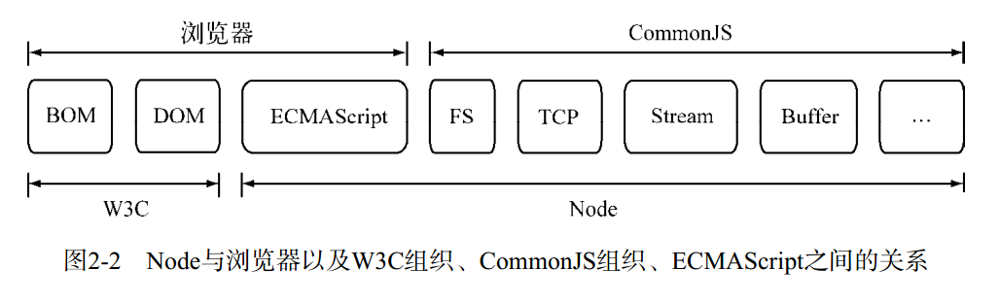

### 4.2 CommonJS 的模块规范

CommonJS对模块的定义十分简单，主要分为：

1、模块引用：

使用 `require()` 方法引入一个模块API ； 

2、模块定义：

在模块中使用 exports 对象导出当前模块数据或方法；

在模块中还存在一个module对象，它代表模块自身，module对象有一个exports 属性，用于数据导出；

 其实exports 对象就是module.exports 的引用;   `exports === module.exports`

3、模块标识：

其实就是模块的文件名，必须符合小驼峰法命名规则，使用`require()` 引入时使用 `. 或 ..` 开头的相对路径或绝对路径，引入时可以不写文件后缀名；

**重点注意** ： 模块中的方法和变量的作用于尽在模块内部，每个模块具有独立的空间，互不干扰；

CommonJS 构建的模块机制中的引入与导出是我们完全不用考虑变量污染或者替换的问题，相比与`命名空间`的机制，简直就是天才和菜鸟的区别；


### 4.3 Node对CommonJS的实现 (Node模块化)


以上代码就是**自定义模块**的基本规则  这是**重点**


### 4.4 模块加载的顺序和规则 

在 CommonJS 规范中，使用 `require()` 加载(引入) 模块时，模块标识必须使用相对路径或绝对路径指明模块位置，但是在node的实现中，我们可以不指明模块路径；如： `require('fs')、require('moment')` ;

如果没有指明路径，那就是加载核心模块或第三方模块，指明加载路径一般就是加载自定义模块；

不管加载什么模块，都是优先从缓存中加载：

>  Node 加载模块时，如果这个模块已经被加载过了，则会直接缓存起来，将来再次引用时不会再次加加载这个模块（即：如果一个模块被加载两次，则模块中的代码只会被执行一次）

而核心模块和第三方模块的的加载顺序就是：

> 先加载核心模块，核心模块的内容都是在安装node时已经编译好的可执行的二进制代码，加载执行的速度，仅次于缓存加载，如果核心模块中没有，则加载第三方模块

第三方模块的加载规则：

> - 先在当前文件的模块所属目录去找 node_modules目录
> - 如果找到，则去该目录中找 模块名的目录  如 : moment 
> - 如果找到 moment 目录， 则找该目录中的 package.json文件
> - 如果找到 package.json 文件，则找该文件中的 main属性
> - 如果找到main 属性，则拿到该属性对应的文件
> - 如果找到 moment 目录之后，
>   - 没有package.json
>   - 或者有 package.json 没有 main 属性
>   - 或者有 main 属性，但是指向的路径不存在 
>   - 则 node 会默认去看一下 moment 目录中有没有 index.js --> index.json--> index.node 文件
> - 如果找不到index 或者 找不到 moment 或者找不到 node_modules 
> - 则进入上一级目录找 node_moudles 查找（规则同上）
> - 如果上一级还找不到，继续向上，一直到当前文件所属磁盘的根目录
> - 如果到磁盘概目录还没有找到，直接报错


### 4.5 模块化封装案例

修改 http.js --- 服务器模块

```js
var http = require('http');
var server = http.createServer();
var luyou = require('./luyou');

luyou.server(server);

server.listen(8000, function () {
    console.log('请访问 127.0.0.1:8000');
})

```


添加自定义模块  luyou.js  -- 路由模块 

```js
var contrllor = require('./contrllor');
var fs = require('fs');
function server(server) {
    server.on('request', function (request, response) {
        var urls = request.url;
        if (urls == '/') {
            var html = contrllor.html;
            response.setHeader('Content-Type', 'text/html;charset=utf-8');
            response.end(html);
        }
        else {
            fs.readFile('.' + urls, function (error, data) {
                response.setHeader('Content-Type', 'text/html;charset=utf-8');
                response.end(data);
            })
        }

        // response.end('123');
    });
}
exports.server = server;
```


contrllor.js --- 业务模块

```js
var fs = require('fs');
var moment = require('moment');
var template = require('art-template');
template.defaults.root = './';

fs.readdir('./', 'utf8', function (err, files) {
    var file_arr = [];
    var cont = 0;
    for (var i = 0; i < files.length; i++) {
        file_arr[i] = {};
        // console.log(files[i]);
        (function (i) {
            fs.stat(files[i], function (err, data) {
                cont++;
                // 闭包  
                if (data.isFile()) {
                    file_arr[i].type = 'file';
                } else {
                    file_arr[i].type = 'dir';
                }
                file_arr[i].name = files[i];
                file_arr[i].size = data.size;
                file_arr[i].mtime = moment(data.mtime).format('YYYY-MM-DD hh:mm');
                if (cont == files.length) {
                    var html = template('./apache.html',{data:file_arr});
                    exports.html = html;
                }
            })
        })(i);
    }
})
```


## 第5章 用户管理系统--项目

### 5.1 连接MySQL数据库

#### 5.1.1 mysql基本CURD

```sql
SELECT `id`, `name` FROM `users` WHERE 1 

INSERT INTO `users`(`id`, `name`) VALUES ([value-1],[value-2])

UPDATE `users` SET `name`='value' WHERE id=1

DELETE FROM `users` WHERE id=value
```


#### 5.1.2  安装连接MySQL

`npm install mysql`

mysql.js :  

```js
var mysql = require('mysql');
var connection = mysql.createConnection({
    host: 'localhost',
    user: 'root',
    password: '',
    database: 'onepiece'
});
// 查找操作
var select = 'select * from users';
connection.query(select, function (error, results, fields) {
    for(var i=0;i<results.length;i++){
        console.log(results[i].name);
    }
});

// 添加操作
var ins = "INSERT INTO users (`name`, `nengli`, `jituan`, `img`) VALUES ('娜美', '雷电', '草帽海贼团', '')";
connection.query(ins,function(err,results,field){
    console.log(results.insertId)
})

connection.end();
```


### 5.2 项目初始化及安装第三方模块

新建目录 `haizei`  , 打开命令行执行 ` npm init` 初始化项目;

一次性安装项目所需的所有模块;

`npm install art-template mysql bootstrap jquery`


### 5.3 启动项目

#### 5.3.1 创建http服务器并加载静态页面

http.js

```js
var http=require('http');
// 加载路由模块
var luyou = require('./luyou');
var server = http.createServer();

luyou.bind(server);

server.listen('8080',function(){
    console.log('请打开浏览器访问 http://127.0.0.1:8080');
});
```


luyou.js

```js
var fs = require('fs');
// 引入业务模块使用模板引擎加载页面
var yewu = require('./yewu');
exports.bind = function (server) {
    server.on('request', function (request, response) {
        var urls = request.url;
        if (urls == '/') {
            var data = yewu.html_data;
            response.end(data);

        } else {
            fs.readFile('.' + urls, function (error, data) {
                response.end(data);
            })
        }
    })
}
```


yewu.js

```js
var template = require('art-template');
template.defaults.root = './';
var html_data = template('./index.html',{data:123});

exports.html_data = html_data;
```


#### 5.3.2 动态获取数据


yewu.js

```js
var linkdb = require('./linkdb');
var template = require('art-template');
template.defaults.root = './';
console.log(linkdb.data);
var html_data = template('./index.html',{data:linkdb.data});

exports.html_data = html_data;
```


linkdb.js

```js
var mysql = require('mysql');

var mysql = require('mysql');
var connection = mysql.createConnection({
    host: 'localhost',
    user: 'root',
    password: '',
    database: 'onepiece'
});

connection.connect();

var sql = "select * from users ";

connection.query(sql,function(error,data,res){
    console.log(data);
    exports.data = data
});

connection.end();
```

通过连接数据查找到的数据，对外导出时，导不出去，引入linkdb的业务模块，接不到数据；

关键：这个问题出现的原因很重；


#### 5.3.3 解决问题

yewu.js

```js
var linkdb = require('./linkdb');
var template = require('art-template');
template.defaults.root = './';

// 使用linkdb模块导出的方法
linkdb.query(function(data){
    // 利用回调函数获取数据
    var html_data = template('./index.html',{data:data});
    exports.html_data = html_data;
});
```


linkdb.js

```js
var mysql = require('mysql');

var connection = mysql.createConnection({
    host: 'localhost',
    user: 'root',
    password: '',
    database: 'onepiece'
});
connection.connect();
// 将原来导出数据的方式改为导出方法，供模块加载者调用
exports.query = function(callback){
    var sql = "select * from users ";
    connection.query(sql,function(error,data,res){
        // console.log(data);
        // 数据是通过回调函数的方式返回
        callback(data)
    });
    connection.end();
}
```


根据模板引擎语法 修改静态页面 

```html
<tbody id="tbody">
    {{each data}}
    <tr>
        <td>{{$value.id}}</td>
        <td>{{$value.name}}</td>
        <td>{{$value.nengli}}</td>
        <td>{{$value.jituan}}</td>
        <td>
            <a href="#">查看</a>
            <a href="#">修改</a>
            <a href="#">删除</a>
        </td>
    </tr>
    {{/each}}
</tbody>
```


### 5.4 获取单个用户信息

#### 5.4.1 接受前台请求

修改 luyou.js 路由模块，获取单个用户信息

```js
server.on('request', function (request, response) {
    var urls = request.url;
    console.log(urls);
    if (urls == '/') {
        var data = yewu.html_data;
        response.end(data);

    }else if(urls == '/getuser'){
        response.end('getsssss');
    }else {
        fs.readFile('.' + urls, function (error, data) {
            response.end(data);
        })
    }
})
```

但是，luyou模块，无法处理前台不同类型的请求, 需要我们在服务器端接受并处理客户端发送的 **get 及 post** 请求；


#### 5.4.2  获取请求类型及参数

GET 请求把所有的内容编码到访问路径中，POST  请求的内容全部都在请求体中。
http.ServerRequest   并没有一个属性内容为请求体，原因是等待请求体传输可能是一件
耗时的工作，譬如上传文件。而很多时候我们可能并不需要理会请求体的内容，恶意的 POST 
请求会大大消耗服务器的资源。所以 Node.js  默认是不会解析请求体的，当我们需要的时候，
只能手动来做


> 网络调试工具Postman，可以帮助我们发送各种HTTP请求，并接受服务器返回的数据；
>
> https://www.getpostman.com/


**获取请求类型**

```js
var http = require('http');
var server = http.createServer();

server.on('request', function(request, response) {
    // 获取请求类型
    var method = request.method;
    console.log(method);
    response.end();
});

server.listen(8000, function() {
    console.log(' 请访问http://localhost:8000');
});
```


**获取 GET 的请求参数**


**获取Post请求参数**

```js
else if (method == "POST") {
        // url_obj = url.parse(request.url,true);
        // console.log(url_obj.query); 
        
        //以上代码 无内容，失败
        // POST请求的内容全部都在请求体中 
}
```


手册中明确说明：

为了支持各种可能的 HTTP 应用，Node.js 的 HTTP API 是非常底层的。 它只涉及流处理与消息解析。 它把一个消息解析成消息头和消息主体，但不解析具体的消息头或消息主体。

因此我们需要查找更底层的网络实现，node中的基础网络模块net模块： http://nodejs.cn/api/net.html：


```js
else if (method == "POST") {
    // url_obj = url.parse(request.url,true);
    // console.log(url_obj.query); 

    //以上代码 无内容，失败
    // POST请求的内容全部都在请求体中 

    var data = '';
    // net 模块中的 net.Socket 提供的data及end事件 
    // 绑定data事件获取数据
    request.on('data', function (che) {
        data += che;
    })
    // 绑定end事件，监听数据接受完成
    request.on('end', function () {
        // console.log(data);
        console.log(require('querystring').parse(data));
    })
}
```


### 5.5 获取单个用户信息

**1： 修改路由逻辑，优先判断请求类型：**

```js
var fs = require('fs');
var url = require('url');
// 引入业务模块使用模板引擎加载页面
var yewu = require('./yewu');

exports.bind = function (server) {
    server.on('request', function (request, response) {
        // 优先判断请求方式
        var method = request.method;
        // 解析URL参数
        var url_obj = url.parse(request.url, true);
        if(method == 'GET'){
            // console.log(url_obj.query);//参数

            if (url_obj.pathname == '/') {
                var data = yewu.html_data;
                response.end(data);
                
            // 判断 获取单个用户信息路由 
            }else if(url_obj.pathname == '/getuser'){
                
            }else {
                fs.readFile('.' + url_obj.pathname, function (error, data) {
                    response.end(data);
                })
            }
        }else if(method == 'POST'){
            
        }
    })
}
```


**2： 修改静态模板，添加查看连接**

```html
 <td>
     <a href="/getuser?id={{$value.id}}">查看</a>
     <a href="#">修改</a>
     <a href="#">删除</a>
</td>
```


**3：修改路由，获取get请求参数，并将id参数传入业务模块**

```js
// 判断 获取单个用户信息路由 
else if(url_obj.pathname == '/getuser'){
    // 获取id参数
    var id = url_obj.query.id;
    // 在yewu模块中封装方法，传递id参数。
    // 使用回掉函数获取数据
    yewu.gets(url_obj.query.id,function(data){
        response.end(data);
    });
}
```


**4：修改业务模块，添加gets方法**

```js
// 封装gets方法并导出,接受id参数及回调函数
exports.gets = function(id,callback){
    // 调用数据库模块的getone方法,并传入id参数
    linkdb.getone(id,function(data){
        // 利用回调函数获取数据
        var user_data = template('./users.html',{data:data});
        callback(user_data);
    });
}
```


**5：添加users.html静态模板**

```html
<body>
    {{data[0].name}}
    {{data[0].nengli}}
    {{data[0].jituan}}
    {{data[0].name}}
    {{data[0].name}}
</body>
```


**6：修改数据库模块，添加getone方法**

```js
exports.getone = function(id,callback){
    var sql = "select * from users where id="+id;
    // console.log(sql);
    connection.query(sql,function(error,data,res){
        console.log(data);
        // 数据是通过回调函数的方式返回
        callback(data)
    });
    // connection.end();
}
```

> 注意：将数据库模块中的所有 connection.end(); 删除，因为我们有多个方法，不能在方法调用中停止数据库的连接，否则，其他方法在后续调用中无法连接数据；


### 5.6 链式操作原理解析

**链式操作的核心原理：**

test.js

```js
var c = require('./chained1');
// c.select();
c.where('id=2').select();
```

chained.js

```js
module.exports = {
    where: function (wh) {
        this.whe = wh;
        // 链式操作的核心就是保存数据并返回本对象
        return this;
    },
    select: function () {
        if (this.whe == undefined) {
            var sql = "select * from users ";
        } else {
            var sql = "select * from users where " + this.whe;
        }
        console.log(sql);
        this.whe = undefined;
    },
    update:function(){
        if (this.whe == undefined) {
            console.log('更新数据时，请填写where条件');
            return;
        } else {
            var sql = "update xx from  set () where " + this.whe;
        }
        console.log(sql);
        this.whe = undefined;
    }
}
```


### 5.7 使用链式操作灵活操作数据库

**1：新建数据操作模块 db.js**

```js
var mysql = require('mysql');
var connection = mysql.createConnection({
    host: 'localhost',
    user: 'root',
    password: '',
    database: 'onepiece'
});

module.exports = {
    that: this,
    where: function (wh) {
        this.whe = wh;
        return this;
    },
    select: function (callback) {
        if (this.whe == undefined) {
            var sql = "select * from users ";
        } else {
            var sql = "select * from users where " + this.whe;
        }
        // 用完后重置where条件，以免后续操作的数据重复
        this.whe = undefined;
        connection.query(sql, function (error, results, fields) {
            if (error) {
                callback(error);
                return;
            }
            callback(results);
        });
    }
}
```


**2：修改业务模块(yewu.js)的调用**

```js
// var linkdb = require('./linkdb');
var db = require('./db');
var template = require('art-template');
template.defaults.root = './';

module.exports = {
    getall: function (callback) {
        db.select(function (data) {
            // 利用回调函数获取数据
            var html_data = template('./index.html', { data: data });
            callback(html_data);
        });
    },
    getone:function(id,callback){
        db.where('id='+id).select(function(data){
            var user_data = template('./users.html',{data:data});
            callback(user_data);
        });
    }

}
```


**3：修改路由模块(luyou.js)的调用**

```js
var fs = require('fs');
var url = require('url');
// 引入业务模块使用模板引擎加载页面
var yewu = require('./yewu');

exports.bind = function (server) {
    server.on('request', function (request, response) {
        // 优先判断请求方式
        var method = request.method;
        // 解析URL参数
        var url_obj = url.parse(request.url, true);
        if(method == 'GET'){
            // console.log(url_obj.query);//参数
            if (url_obj.pathname == '/') {
                yewu.getall(function(data){
                    response.end(data);
                })
                
            // 判断 获取单个用户信息路由 
            }else if(url_obj.pathname == '/getuser'){
                // 获取id参数
                var id = url_obj.query.id;
                // 在yewu模块中封装方法，传递id参数。
                // 使用回掉函数获取数据
                yewu.getone(url_obj.query.id,function(data){
                    response.end(data);
                });
            }else {
                fs.readFile('.' + url_obj.pathname, function (error, data) {
                    response.end(data);
                })
            }
        }else if(method == 'POST'){

        }
    })
}
```


### 5.8 修改用户信息

#### 5.8.1 修改模板代码，添加链接

```html
<tbody id="tbody">
    {{each data}}
    <tr>
        <td>{{$value.id}}</td>
        <td>{{$value.name}}</td>
        <td>{{$value.nengli}}</td>
        <td>{{$value.jituan}}</td>
        <td>
            <a href="/getuser?id={{$value.id}}">查看</a>
            <a href="/upuser?id={{$value.id}}">修改</a>
            <a href="#">删除</a>
        </td>
    </tr>
    {{/each}}
</tbody>
```


#### 5.8.2 获取用户信息并填入表单

**1：添加路由判断(luyou.js)**

```js
// 修改用户信息，先获取用户信息    
}else if(url_obj.pathname == '/upuser'){
    // 获取id参数
    var id = url_obj.query.id;
    // 在yewu模块中封装方法，传递id参数。
    // 使用回掉函数获取数据
    yewu.upuser_get(url_obj.query.id,function(data){
        response.end(data);
    });
}else {
```


**2：添加业务逻辑（yewu.js），获取用户信息**

```js
upuser_get:function(id,callback){
    db.where('id='+id).select(function(data){
        var user_data = template('./upuser.html',{data:data});
        callback(user_data);
    });
}
```


**3：添加表单模板（upuser.html）**

```html
<style>
    table {
        margin: 0 auto;
        border-collapse: collapse;
        width: 800px;
        height: 500px;
    }

    td {
        border: 1px solid #ccc;
    }
</style>

<body>
    <form action="/upuser?id={{data[0].id}}" method="post">
        <table>
            <tr>
                <td>姓名</td>
                <td><input name="name" type="text" value="{{data[0].name}}"></td>
            </tr>
            <tr>
                <td>能力</td>
                <td><input name="nengli" type="text" value="{{data[0].nengli}}"></td>
            </tr>
            <tr>
                    <td>团体</td>
                    <td><input name="tuanti" type="text" value="{{data[0].jituan}}"></td>
                </tr>
            <tr>
                <td>上传图片</td>
                <td><input type="file"></td>
            </tr>
            <tr>
                <td></td>
                <td><input type="submit" value="修改"></td>
            </tr>
        </table>
    </form>
</body>
```


#### 5.8.3 获取并处理post提交数据，修改数据库

**路由模块(luyou.js)**

```js
 else if (method == 'POST') {
     // 只要是POST请求，则优先获取数据
     // 后处理路由逻辑
     var data = '';
     request.on('data', function (che) {
         data += che;
     })
     // 绑定end事件，监听数据接受完成
     request.on('end', function () {
         // console.log(data);
         // 获取Post传输的数据
         var post_data = querystring.parse(data);
         // 路由判断
         if (url_obj.pathname == '/upuser') {
             // 调用业务层方法
             yewu.upuser_post(url_obj.query.id, post_data, function (data) {
                 response.end(data);
             });
         }
     })

 }
```


**业务模块（yewu.js）**

```js
upuser_post:function(id,data,callback){
    // 调用数据模块修改用户信息
    db.where('id='+id).update(data,function(changedRows){
        // http服务器相应要求必须是字符串
        callback(changedRows.toString());
    })
}
```


**数据库模块（db.js）**

```js
update:function(data,callback){
    // 没where条件，则停止所有操作
    if(this.where == undefined){
        callback('error');
        return;
    }
    // 拼接sql语句的set部分
    var set = '';
    for(v in data){
        set += v +"='"+ data[v]+"',";
    }
    var sets = set.slice(0,set.length-1);
    var sql = "UPDATE `users` SET "+sets + ' where '+ this.whe;
    // console.log(sql);
    this.whe = undefined;
    connection.query(sql,function(error,res,fields){
        // console.log(error)
        // 返回受影响行数
        callback(res.changedRows);
    })
}
```


> 作业： 自己完成添加及删除操作


## 第6章 ES6语法及JS语言的其他特性

### 6.0 ECMAScript的变迁

ECMAScript 1.0（1997年）

ECMAScript 2.0（1998年）

ECMAScript 3.0（1999年12月）

ECMAScript 4.0 (太激进,夭折了)

ECMAScript 5.0 (2009) 

ECMAScript 6.0 (2015) 

3.0版是一个巨大的成功，在业界得到广泛支持，成为通行标准，奠定了JavaScript语言的基本语法，以后的版本完全继承。
直到今天，初学者一开始学习JavaScript，其实就是在学3.0版的语法。
5.0版和3.0版区别不大。

随着JS的崛起,应用于移动开发,后端开发,游戏开发等,业界对JS的语言的要求越来越高.
此时再看4.0时提出的设想,已经不显得激进了.于是,6.0版本终于通过了.

此标准严格的叫法应是`ECMAScript2015`,当然叫`ES6`也没啥,没人和你抬杠.


ESMAScript 与 JavaScript 两者的关系, 就如同 *快捷宾馆营业标准* 和 *如家酒店* 一样.

**浏览器支持情况**

http://kangax.github.io/compat-table/es6/


### 6.1 变量的声明

#### 6.1.1 let 块级证明

ES6 新增了`let`命令，用来声明变量。

它的用法类似于`var`，但是所声明的变量，只在`let`命令所在的代码块内有效。

看下例:

```js
var a = 3;
let b = 4;
console.log(a , b); // 相同的效果
```

再看下例:

```js
{
  let c = 'hello';
  var b = 'world';
}

console.log(c) //ReferenceError: c is not defined
console.log(d) // world
```

可以看出: `let`命令在定义的`{}`内生效,某些语言也有类似特点，我们将其称为"块级作用域".

这样,`let`定义的变量,只在块内生效,不影响其他区域,所以我们说Ta更 "清洁".

在某些场合下,用`let`特别适合,比如`for()`循环

```js
// 设置i仅为循环数组,但循环后,残留一个变量i.
var arr = ['a' , 'b' , 'c'];
for(var i=0; i<arr.length; i++) {
}
console.log(i); // 3
```

换成`let`再试一下,是不是更清洁?

```js
// i变量只在for()内有效,不污染其他区域
var arr = ['a' , 'b' , 'c'];
for(let i=0; i<arr.length; i++) {
}
console.log(i); // ReferenceError: i is not defined
```

不污染全局的window属性

```js
var c = 'hello';
let d = 'world';

window.d; //undefined
window.c; //hello
```

注:同域下,var ,let 声明同一变量名,error


> let 申明的变量不存在变量提升 
>
> let 申明的变量不允许重复声明
>
> let 申明的变量存在块级作用域


#### 6.1.2 const 常量

常量并不稀奇 (话外音：都21世纪了，你咋现在才有?)
PHP,Java,C,C++ ...多数语言都有常量.

`const` 声明一个只读的常量。一旦声明，常量的值就不能改变。


常量,即不可改变其值的量.

```js
const PI = 3.14;
console.log(PI);

// 一旦声明值不可修改
PI = 3.15; // TypeError: Assignment to constant variable.
// 不可重复声明
const PI = 3.15; // Identifier 'PI' has already been declare

// 因为声明后值不能修改，所以声明必须赋值
const c ;// Missing initializer in const declaration
```

注:常量名和变量名,都区分大小写


```js
const STU = {name:'lucy' , age : 22};
console.log(STU); // { name: 'lucy', age: 22 }
STU.name = 'lily';
console.log(STU); // { name: 'lily', age: 22 }
```

注：常量不可改变的是其引用地址；


### 6.2 模板字符

ES6用反引号 **( ` )**  包住字符串,可以让字符串多行书写,也可以自由的嵌入变量.

```js
function t() {
    return 'world';
}

var obj = {name:'李四'}

let str = `hello${obj.name} ${t()} , ${7 + 9} , ${'ok'},
这是个换行
`;
console.log(str);

// hello李四 world , 16 , ok,
// 这是个换行

```


### 6.3 变量的解构赋值

ES6 允许按照一定模式，从数组和对象中提取值，对变量进行赋值，这被称为解构（Destructuring）。

字符串解构赋值

```javascript
const [a, b, c, d, e] = 'hello';
a // "h"
b // "e"
c // "l"
d // "l"
e // "o"
```


#### 6.3.1 数组的解构赋值

以前，为变量赋值，只能直接指定值。

```js
var a = 1;
var b = 2;
var c = 3;
//ES6允许写成下面这样。
let [a, b, c] = [1, 2, 3];
```

上面代码表示，可以从数组中提取值，按照对应位置，对变量赋值。

本质上，这种写法属于“模式匹配”，只要等号两边的模式相同，左边的变量就会被赋予对应的值。下面是一些使用嵌套数组进行解构的例子。

```js
let [foo, [[bar], baz]] = [1, [[2], 3]];
foo // 1
bar // 2
baz // 3

let [ , , third] = ["foo", "bar", "baz"];
third // "baz"

let [x, , y] = [1, 2, 3];
x // 1
y // 3

let [head, ...tail] = [1, 2, 3, 4];
head // 1
tail // [2, 3, 4]

let [x, y, ...z] = ['a'];
x // "a"
y // undefined
z // []
```


#### 6.3.2 对象的解构赋值

解构不仅可以用于数组，还可以用于对象。

```javascript
let { foo, bar } = { foo: "aaa", bar: "bbb" };
foo // "aaa"
bar // "bbb"
```

对象的解构与数组有一个重要的不同。数组的元素是按次序排列的，变量的取值由它的位置决定；而对象的属性没有次序，变量必须与属性同名，才能取到正确的值。

```javascript
let { bar, foo } = { foo: "aaa", bar: "bbb" };
foo // "aaa"
bar // "bbb"

let { name } = { foo: "aaa", bar: "bbb" };
name // undefined
```

上面代码的第一个例子，等号左边的两个变量的次序，与等号右边两个同名属性的次序不一致，但是对取值完全没有影响。第二个例子的变量没有对应的同名属性，导致取不到值，最后等于`undefined`。


### 6.4 对象的扩展

#### 6.4.1 属性的简洁表示法

ES6 允许直接写入变量和函数，作为对象的属性和方法。这样的书写更加简洁。

```javascript
const foo = 'bar';
const baz = {foo};
baz // {foo: "bar"}

// 等同于
const baz = {foo: foo};
```

上面代码表明，ES6 允许在对象之中，直接写变量。这时，属性名为变量名, 属性值为变量的值。


#### 6.4.2 方法的简洁表示法

除了属性简写，方法也可以简写。

```javascript
function fun (){
    console.log(this.a + this.b);
}

var obj = {
    a:1,
    fun:fun,
    b:2,
};
obj.fun(); // 3
// 等同于
var obj = {
    a:3,
    fun,
    b:4,
};
obj.fun(); // 7
// 等同于
var obj = {
    a:5,
    fun(){console.log(this.a + this.b);},
    b:6,
};
obj.fun(); // 11
```


CommonJS 模块输出一组数据及方法，就非常合适使用简洁写法。

```js
function getItem() {
}

function setItem() {
}

function clear() {
}

module.exports = { getItem, setItem, clear };
// 等同于
module.exports = {
    getItem: getItem,
    setItem: setItem,
    clear: clear
};
```


### 6.5 Promise 异步控制对象

> https://developer.mozilla.org/zh-CN/docs/Web/JavaScript/Guide/Using_promises


#### 6.5.1为什么要使用 Promise

**以读取文件内容为例：**

无法保证顺序的代码

```javascript
var fs = require('fs')

fs.readFile('./data/a.txt', 'utf8', function (err, data) {
  if (err) {
    // return console.log('读取失败')
    // 抛出异常
    //    1. 阻止程序的执行
    //    2. 把错误消息打印到控制台
    throw err
  }
  console.log(data)
})

fs.readFile('./data/b.txt', 'utf8', function (err, data) {
  if (err) {
    // return console.log('读取失败')
    // 抛出异常
    //    1. 阻止程序的执行
    //    2. 把错误消息打印到控制台
    throw err
  }
  console.log(data)
})

fs.readFile('./data/c.txt', 'utf8', function (err, data) {
  if (err) {
    // return console.log('读取失败')
    // 抛出异常
    //    1. 阻止程序的执行
    //    2. 把错误消息打印到控制台
    throw err
  }
  console.log(data)
})

```

通过回调嵌套的方式来保证顺序：

```js
var fs = require('fs')

fs.readFile('./data/a.txt', 'utf8', function (err, data) {
  if (err) {
    // return console.log('读取失败')
    // 抛出异常
    //    1. 阻止程序的执行
    //    2. 把错误消息打印到控制台
    throw err
  }
  console.log(data)
  fs.readFile('./data/b.txt', 'utf8', function (err, data) {
    if (err) {
      // return console.log('读取失败')
      // 抛出异常
      //    1. 阻止程序的执行
      //    2. 把错误消息打印到控制台
      throw err
    }
    console.log(data)
    fs.readFile('./data/c.txt', 'utf8', function (err, data) {
      if (err) {
        // return console.log('读取失败')
        // 抛出异常
        //    1. 阻止程序的执行
        //    2. 把错误消息打印到控制台
        throw err
      }
      console.log(data)
    })
  })
})
```


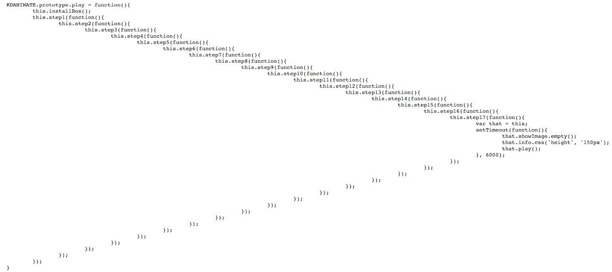


多层使用回调函数，就会进入 "**回调地狱**"

为了解决以上编码方式带来的问题（回调地狱嵌套），所以在 EcmaScript 6 中新增了一个 API：`Promise`。


#### 6.5.2 Promise 的使用

```js
var fs = require('fs')

// 在 EcmaScript 6 中新增了一个 API Promise
// Promise 是一个构造函数

// 创建 Promise 容器
// 1. 给别人一个承诺 I promise you.
//    Promise 容器一旦创建，就开始执行里面的代码
var p1 = new Promise(function (resolve, reject) {
  // console.log(2)
  fs.readFile('./data/aa.txt', 'utf8', function (err, data) {
    if (err) {
      // 失败了，承诺容器中的任务失败了
      // console.log(err)
      // 把容器的 Pending 状态变为 Rejected

      // 调用 reject 就相当于调用了 then 方法的第二个参数函数
      reject(err)
    } else {
      // console.log(3)
      // 承诺容器中的任务成功了
      // console.log(data)
      // 把容器的 Pending 状态改为成功 Resolved
      // 也就是说这里调用的 resolve 方法实际上就是 then 方法传递的那个 function
      resolve(data)
    }
  })
})

// console.log(4)

// p1 就是那个承若
// 当 p1 成功了 然后(then) 做指定的操作
// then 方法接收的 function 就是容器中的 resolve 函数
p1
  .then(function (data) {
    console.log(data)
  }, function (err) {
    console.log('读取文件失败了', err)
  })
```


封装 Promise 版本的 `readFile`:

```javascript
var fs = require('fs')

function pReadFile(filePath) {
  return new Promise(function (resolve, reject) {
    fs.readFile(filePath, 'utf8', function (err, data) {
      if (err) {
        reject(err)
      } else {
        resolve(data)
      }
    })
  })
}

pReadFile('./data/a.txt')
  .then(function (data) {
    console.log(data)
    return pReadFile('./data/b.txt')
  })
  .then(function (data) {
    console.log(data)
    return pReadFile('./data/c.txt')
  })
  .then(function (data) {
    console.log(data)
  })

```


### 6.6 箭头函数

https://developer.mozilla.org/zh-CN/docs/Web/JavaScript/Reference/Functions/Arrow_functions

ES6 允许使用“箭头”（`=>`）定义函数。

**箭头函数表达式**的语法比 *函数表达式* 更短，并且没有自己的 this，arguments。这些函数表达式更适用于那些本来需要匿名函数的地方，并且它们不能用作构造函数。

```js
var fun1 = function(str1,str2){
    return (str1 + str2);
}
// ↓ 

var fun2 = (str1,str2)=>{
    return (str1 + str2);
}
// ↓ 

var fun3 = (str1,str2) => str1 + str2;


console.log(fun1(1,2)); // 3
console.log(fun2(2,3)); // 5
console.log(fun1(4,5)); // 9
```


> 如果参数只有一个，可以将()省略    // arr.map(c=>c+1);
> 如果没有参数，则一定能要写上()     // ()=> console.log(‘a’)
> 如果多于一个参数，每个参数之间用逗号分隔   (x, y) => { ... }
> 如果方法体只有一句代码，可以省略{} 和分号，如果有返回可以省略return
> 如果方法体多于一句代码，则不能省略{} ,每句代码使用 分号分隔


**注意：**

> a. 箭头函数没有自己的this，函数体内部写的this，指向的是外层代码块的this
> b. 箭头函数内部的this是定义时所在的对象，而不是使用时所在的对象并且不会改变
> c. 箭头箭头函数不能用作构造函数
> d. 箭头函数内部不存在arguments，箭头函数体中使用的arguments其实指向的是外层函数的arguments


箭头就是让你当做一个普通函数来使用,别整花里胡哨;


## 第7章 express 框架

### 7.1 简介

Express 是基于  Node.js  平台，快速、开放、极简的 Web 开发框架, 提供一系列强大特性帮助你创建各种Web应用。Express 不对 node.js 已有的特性进行二次抽象，我们只是在它之上扩展了Web应用所需的功能。丰富的HTTP工具以及来自Connect框架的中间件随取随用，创建强健、友好的API变得快速又简单


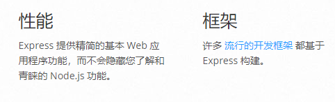

### 7.2 安装使用

就像一个普通的第三方模块一样安装即可；

`npm init`   ` npm install express`  

```js
var express = require('express');
var app = express();

app.get('/',(req,res)=>{
    res.send('hello world !');
})

app.listen('8000',()=>{
    console.log('127.0.0.1：8000')
})
```

其中 [Request、Response -- API](http://www.expressjs.com.cn/4x/api.html)   我们需要重点关注


## 第8章 项目的重构

将我们之前的海贼王项目使用express框架进行重写，重写过程中，学习框架提供的各种API，并完善项目功能；


### 8.1 启动服务器

创建http.js 

```js
var express = require('express');
var app = express();

app.listen('8000',()=>{
    console.log('127.0.0.1：8000')
})
```


### 8.2 重写路由模块

之前我们写了一个独立的模块（luyou.js）来处理请求，而在 express 中已经帮我们写好了路由的请求处理规则，不需要我们进行判断；

***路由*** 是指确定应用程序如何响应对特定端点的客户端请求，该请求是URI（或路径）和特定HTTP请求方法（GET，POST等）。

每个路由都可以有一个或多个处理函数，这些函数在路由匹配时执行。

#### 8.2.1 express 中的基本路由

路径定义采用以下结构：

```javascript
app.method(path, handler)
```

以下示例定义了简单路由。

`Hello World!`在主页上回复：

```javascript
app.get('/', function (req, res) {
  res.send('Hello World!')
})
```

在根路由（`/`），应用程序的主页上响应POST请求：

```javascript
app.post('/', function (req, res) {
  res.send('Got a POST request')
})
```

响应对`/user`路由的PUT请求：

```javascript
app.put('/user', function (req, res) {
  res.send('Got a PUT request at /user')
})
```

响应对`/user`路由的DELETE请求：

```javascript
app.delete('/user', function (req, res) {
  res.send('Got a DELETE request at /user')
})
```


#### 8.2.2. 外置路由

设置 外置路由 rout.js 

```js
var express = require('express');
var router = express.Router();

router.get('/',(req,res)=>{
    res.send('123');
})
router.get('/user',(req,res)=>{
    res.send('user');
})
router.post('/edit',(req,res)=>{
    res.send('post_edit');
})

// 导出 router
module.exports = router;
```

写好路由规则，一定要记得将 路由对象(router) 导出

```js
var express = require('express');
var app = express();

// 引入外置路由
var rout = require('./rout');
app.use(rout); // 使用引入外置的路由

app.listen('8000',()=>{
    console.log('127.0.0.1：8000')
})
```

将外置路由引入后，使用 app.use() 进行加载使用； 


#### 8.2.3 使用外置路由修改项目


在 luyou.js 中，注释以前的代码，添加新代码

```js
var express = require('express');
var yewu = require('./yewu');
var router = express.Router();

router.get('/', (req, res) => {
    yewu.getall(function (data) {
        res.end(data);
    })
})

module.exports = router;
```


在 http.js 中，使用 express 启动服务，并引入使用新修改的 luyou.js 模块

```js
var express = require('express');
var app = express();

var luyou = require('./luyou');
app.use(luyou);

app.listen('8080',()=>{
    console.log('127.0.0.1:8080')
})

```


 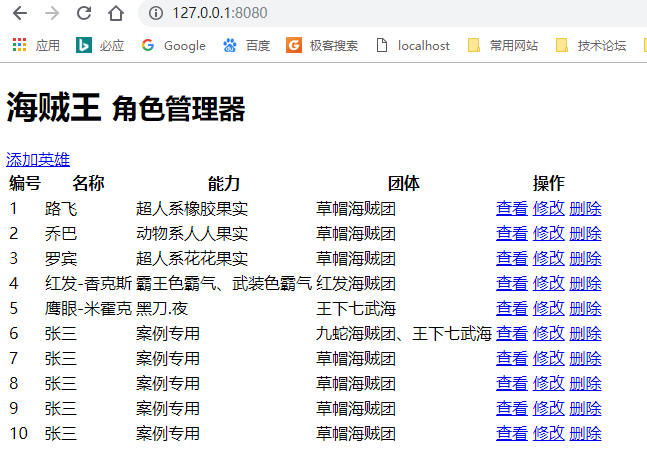


#### 8.2.4 使用链式操作添加路由

luyou.js

```js
var express = require('express');
var yewu = require('./yewu');
var router = express.Router();

// express的路由支持链式操作
router
.get('/', (req, res) => {
    yewu.getall(function (data) {
        res.end(data);
    })
})
.get('/getuser', (req, res) => {
    // req 提供了query属性获取请求参数
    var id = req.query.id;
    // 在yewu模块中封装方法，传递id参数。
    // 使用回掉函数获取数据
    yewu.getone(id, function (data) {
        res.end(data);
    });
})

module.exports = router;
```


#### 8.2.5 优化路由模块

路由模块 (luyou.js) 中只负责调用，调用时，将req  res 传入业务模块

```js
router
.get('/', (req, res) => {
    yewu.getall(req,res);
    // yewu.getall(function (data) {
    //     res.end(data);
    // })
})
.get('/getuser', (req, res) => {
    yewu.getone(req,res);
    // req 提供了query属性获取请求参数
    // var id = req.query.id;
    // // 在yewu模块中封装方法，传递id参数。
    // // 使用回掉函数获取数据
    // yewu.getone(id, function (data) {
    //     res.end(data);
    // });
})
```

业务模块接受 req  res  负责处理请求并响应数据

```js
getall: function (req,res) {
    db.select(function (data) {
        // 利用回调函数获取数据
        var html_data = template('./index.html', { data: data });
        // console.log(html_data);
        res.end(html_data);
    });
},
getone:function(req,res){
    db.where('id='+req.query.id).select(function(data){
        var user_data = template('./users.html',{data:data});
        res.end(user_data);
    });
},
```

**继续简化路由模块**

```js
router
.get('/',yewu.getall)
.get('/getuser',yewu.getone)
```

原理：

```js
function fn(callback){
    var a = 1;
    var b = 2;
    callback(a,b);
}

var pros = function(a,b){
    console.log(a+b);
}

fn(function(a,b){
    pros(a,b);
})

// fn(pros);
```


### 8.3 重写模板引擎

[art-template@4 新特性](https://github.com/aui/art-template/issues/369)

[express-art-template](https://github.com/aui/express-art-template) 


安装：

```shell
npm install --save art-template
npm install --save express-art-template
```


官方示例：

```js
var express = require('express');
var app = express();
app.engine('art', require('express-art-template'));
app.set('view options', {
    debug: process.env.NODE_ENV !== 'production'
});

app.get('/', function (req, res) {
    res.render('index.art', {
        user: {
            name: 'aui',
            tags: ['art', 'template', 'nodejs']
        }
    });
});
```


修改 http.js 将 express-art-template 注册为express框架的模板引擎，并设置模板后缀为 html

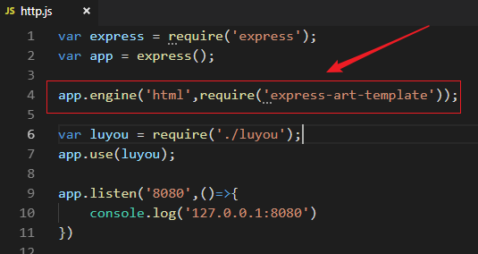


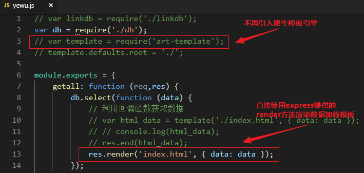


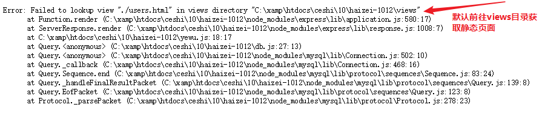

在项目中新建views目录，将所有静态页面放入views目录

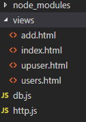


### 8.4 利用 Express 托管静态文件

http://www.expressjs.com.cn/starter/static-files.html

在项目中新建 public 文件夹并将bootstrap.css移入， 修改 index.html 加载 css  静态文件 ，在http.js中引入并设置静态资源加载路径：


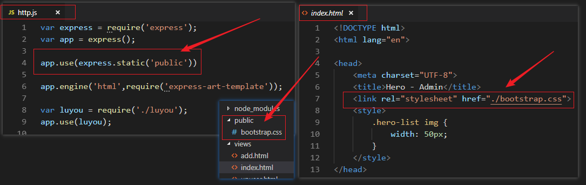


如果要使用多个静态资源目录，请多次调用 `express.static` 函数：

```javascript
app.use(express.static('public'))
app.use(express.static('files'))
```

访问静态资源文件时，`express.static` 函数会根据目录的添加顺序查找所需的文件。


### 8.5 完成项目重构

修改所有路由及业务模块代码


luyou.js

```js
var express = require('express');
var yewu = require('./yewu');
var router = express.Router();

router
.get('/',yewu.getall)
.get('/getuser',yewu.getone)
.get('/upuser',yewu.upuser_get)
.post('/upuser',yewu.upuser_post);

module.exports = router;

```


yewu.js

```js
// var linkdb = require('./linkdb');
var db = require('./db');
var querystring = require('querystring');
// template.defaults.root = './';

module.exports = {
    getall: function (req, res) {
        db.select(function (data) {
            res.render('index.html', { data: data });
        });
    },
    getone: function (req, res) {
        db.where('id=' + req.query.id).select(function (data) {
            res.render('./users.html', { data: data });
        });
    },
    upuser_get: function (req, res) {
        db.where('id=' + req.query.id).select(function (data) {
            res.render('./upuser.html', { data: data });
        });
    },
    upuser_post: function (req, res) {
        var data = '';
        req.on('data', function (che) {
            data += che;
        })
        // 绑定end事件，监听数据接受完成
        req.on('end', function () {
            // console.log(data);
            // 获取Post传输的数据
            var post_data = querystring.parse(data);

            // 调用数据模块修改用户信息
            db.where('id=' + req.query.id).update(post_data, function (changedRows) {
                // http服务器相应要求必须是字符串
                res.json(changedRows);
            })
        })
    }
}

```


### 8.6 展示用户头像

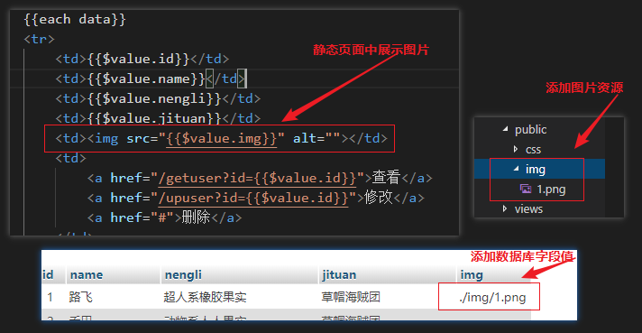


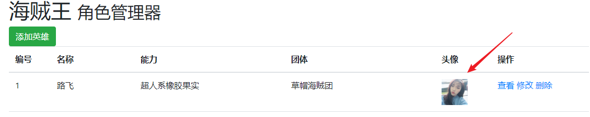


### 8.7 修改用户头像

#### 8.7.1 测试文件上传

创建服务器：

```js
var express = require('express');
var app = express();

app.post('/upfile',(req,res)=>{
    var data = '';
    req.on('data', function (che) {
        data += che;
    });
    req.on('end',()=>{
        // 直接打印post传过来的数据
        console.log(data);
    })
})

app.listen('8000',()=>{
    console.log('127.0.0.1：8000')
})
```


使用postman工具上传文件：

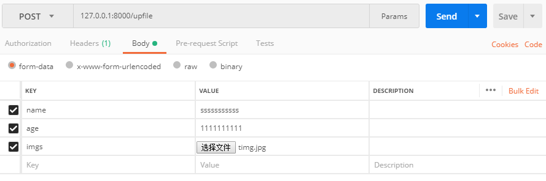


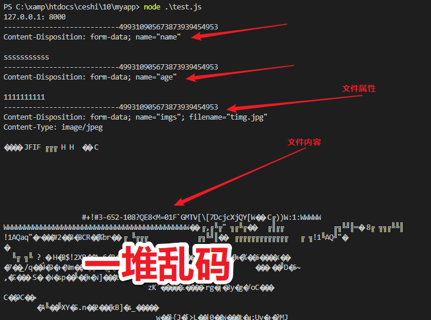


#### 8.7.2 借助第三方插件处理文件上传

https://www.npmjs.com/package/formidable

安装模块  `npm install formidable`


```js
var express = require('express');
var formidable = require('formidable');
var fs = require('fs');
var app = express();

app.post('/upfile', (req, res) => {
    var form = new formidable.IncomingForm();
    
    // form.uploadDir = './img'; // 设置上传路径
    // form.keepExtensions = true; // 保留文件扩展名

    form.parse(req, function (err, fields, files) {
        var times = new Date().getTime();
        // 组装上传路径
        var file_path = './img/'+times+files.imgs.name;
        // 将缓存文件移动至制定目录
        fs.rename(files.imgs.path,file_path,(err)=>{
            console.log(file_path);
        });
        res.end();
    });
})

app.listen('8000', () => {
    console.log('127.0.0.1：8000')
})
```


#### 8.7.3 在项目中实现文件上传

修改 upuser.html

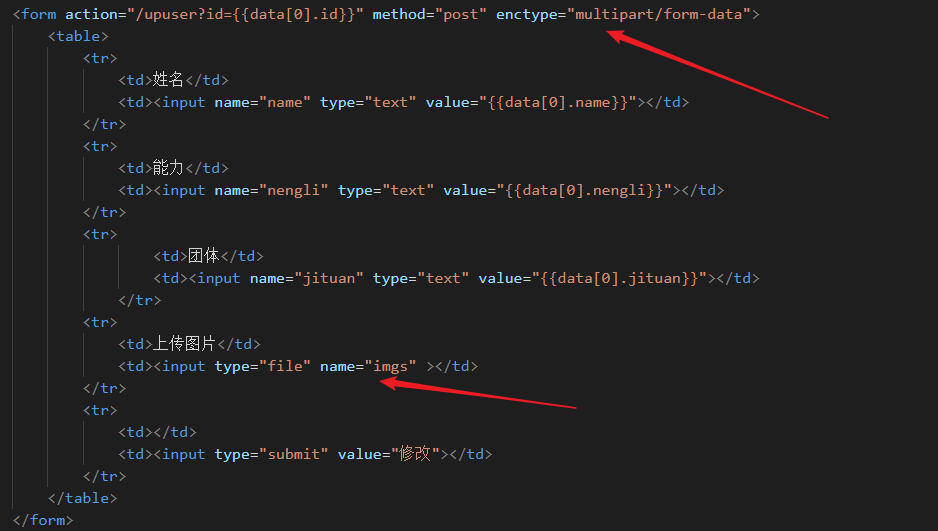


修改业务模块 yewu.js 使用 formidable 获取 post 数据，实现文件上传 

```js
upuser_post: function (req, res) {
    var form = new formidable.IncomingForm();

    form.parse(req, function (err, fields, files) {
        var times = new Date().getTime();
        // 组装上传路径
        var file_path = './public/img/' + times + files.imgs.name;
        // 将缓存文件移动至指定的public目录
        fs.rename(files.imgs.path, file_path, (err) => {
            if(!err){
                // 因为设置静态资源时，已经时public文件夹，写入数据库时，不要加public
                fields.img = './img/' + times + files.imgs.name;
                db.where('id=' + req.query.id).update(fields, function (changedRows) {
                    // http服务器相应要求必须是字符串
                    res.json(changedRows);
                })
            }else{
                console.log('文件上传失败'+err);
            }
        });
    });
}
```


### 8.8 用户登陆

#### 8.8.1 登陆逻辑及cookie-session 的使用

express官方资源中，为我们提供了一个中间件，[cookie-session](http://www.expressjs.com.cn/en/resources/middleware/cookie-session.html) 

 `npm install cookie-session` 

测试代码：

```js
var express = require('express');
var cookieSession = require('cookie-session')
var app = express();

// 注册中间件 
app.use(cookieSession({
    name: 'session', // 客户端cookie的名称
    keys: ['ss'] // 用于加密的关键字
}))

app.get('/', (req, res) => {
    // 获取并判断session
    if(req.session.sess_data){
        res.send('已经登陆')
    }else{
        // 如果没有session,跳转到登陆页面
        res.send('<script>alert("没登陆");window.location.href="/up"</script>');
    }
})
app.get('/up', (req, res) => {
    // 展示登陆页面，获取用户数据并写入session 
    req.session.sess_data = {name:12,age:89};
    res.send('已写入session');
});

```


#### 8.8.2 完成项目登陆功能

**修改http模块，注册 cookie-session 中间件；**

```js
var express = require('express');
var app = express();
var cookieSession = require('cookie-session');

// 注册中间件 
app.use(cookieSession({
    name: 'session', // 客户端cookie的名称
    keys: ['xilingzuishuai'] // 用于加密的关键字
}))
```


**在业务模块 (yewu.js) 中 添加逻辑判断，只有登陆后才能展示首页：**

```js
getall: function (req, res) {
    // 获取并判断session
    if (req.session.sess_data) {
        db.select(function (data) {
            res.render('index.html', { data: data });
        });
    } else {
        // 如果没有session,跳转到登陆页面
        res.send('<script>alert("没登陆");window.location.href="/upload"</script>');
        // res.send('没登陆');
    }
},
```


**在路由模块(luyou.js) 中添加以下两个路由，get 展示静态登陆页面，post 获取用户提交的数据并写入 session ,写入成功后，跳转到首页；在业务模块(yewu.js)中添加响应的方法**

`.get('/upload',yewu.upload_get)`  `.post('/upload',yewu.upload_post)`


```js
upload_get: (req, res) => {
    // 展示登陆页面
    res.render('./upload.html', {});
},

upload_post: (req, res) => {
    var form = new formidable.IncomingForm();
    form.parse(req, function (err, fields, files) {
        // console.log(fields);
        // 获取用户提交数据，判断用户名密码是否正确
        if (fields.userName == "admin" && fields.pwd == "123") {
            // 数据正确，写入session
            req.session.sess_data = fields;
            res.send('<script>alert("登陆成功");window.location.href="/"</script>');
        }else{
            // 数据错误，重新跳回登陆页面
            res.send('<script>alert("登陆失败");window.location.href="/upload"</script>');
        }
    })
}
```


## 第9章 Express的中间件

### 9.1 什么是中间件

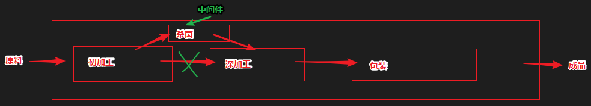

在一个整体的流程中的某个环节，因为某些原因加入了额外的处理环节；


### 9.2    中间件的使用

#### 9.2.1 应用中间件

语法：

> - app.use()
>
>   - app.use(function(){}) 
>
>     无论发送任何请求都会执行的中间件
>
>   - app.use('/path', function(){})
>
>     只要在请求path路由时才会执行的中间件（无论GET/POST）
>
> - app.method()
>
>   - app.get()
>
>     在get请求时会执行的中间件
>
>   - app.post()
>
>     在post请求时会执行的中间件


**app.use() 的用法**

```js
var express = require('express');
var app = express();

// 在中间件之前，不受中间件影响
app.get('/',function(req,res){
    console.log(123);
})

// 应用中间件
// 请求 '/user' 时，会先调用中间件
app.use(function (req, res, next) {
    console.log(req);
    next();
});

// 调用之前先调用中间件
app.get('/user',function(req,res){
    console.log('user');
})

app.listen('8000', () => {
    console.log('127.0.0.1：8000')
})
```


**app.method() 的用法**

```js
var express = require('express');
var app = express();

// 在中间件之前，不受中间件影响
app.get('/',function(req,res){
    console.log(123);
})

// 应用中间件
// 只有在 post 请求user 时才起作用
app.post('/user',function (req, res, next) {
    console.log(req);
    next();
});

// 调用之前先调用中间件
// 接受所有请求方式请求user
app.all('/user',function(req,res){
    console.log('user');
})

app.listen('8000', () => {
    console.log('127.0.0.1：8000')
})
```


#### 9.2.2 路由中间件

路由器层中间件的工作方式与应用层中间件基本相同，差异之处在于它绑定到 `express.Router()` 的实例。

使用 `router.use()` 和 `router.METHOD()` 函数装入路由器层中间件；


我们之前项目的代码，就是在使用路由中间件：

```js
var router = express.Router();

router
.get('/',yewu.getall)
.get('/getuser',yewu.getone)
.get('/upuser',yewu.upuser_get)
.post('/upuser',yewu.upuser_post)

.get('/upload',yewu.upload_get)
.post('/upload',yewu.upload_post)
;
```


#### 9.2.3 内置中间件

 除 `express.static` 外，先前 Express 随附的所有中间件函数现在以单独模块的形式提供：[中间件函数的列表](https://github.com/senchalabs/connect#middleware)

Express 中唯一内置的中间件函数是 `express.static`。此函数基于 [serve-static](https://github.com/expressjs/serve-static)，负责提供 Express 应用程序的静态资源。

对于每个应用程序，可以有多个静态目录：

```javascript
app.use(express.static('public'));
app.use(express.static('uploads'));
app.use(express.static('files'));
```


#### 9.2.4 第三方中间件

使用第三方中间件向 Express 应用程序添加功能。

安装具有所需功能的 Node.js 模块，然后在应用层或路由器层的应用程序中将其加装入。

```js
var cookieSession = require('cookie-session');

// 注册中间件 
app.use(cookieSession({
    name: 'session', // 客户端cookie的名称
    keys: ['xilingzuishuai'] // 用于加密的关键字
}))
```


> 本文档大量参考相关书籍、文档、博客、手册等资源，最终解释权归 [**西岭老湿**](https://zhuanlan.zhihu.com/xilinglaoshi) 个人所有；
>
>
>
> 参考资源相关列表:
>
> [https://nodejs.org/zh-cn/](https://nodejs.org/zh-cn/)   node.js官网 
>
> [http://nodejs.cn/](http://nodejs.cn/)  node.js中文网 
>
> 《深入浅出Node.js》  朴灵著 ，人民邮电出版社
>
> https://en.wikipedia.org/wiki/CommonJS  维基百科 
>
> [《ECMAScript 6 入门》(第三版)](http://es6.ruanyifeng.com/)  阮一峰著 ，电子工业出版社
>
> 《你不知道的JavaScript》(上、中、下卷)   [美] Kyle Simpson 著 ，人民邮电出版社
>
> http://www.expressjs.com.cn/   express中文网
>
>


