# Vue前后端分离项目

## 第0章 项目如何开始的

### 0.1 总体流程

需求调研-->需求转为需求文档-->将需求文档转为开发文档-->前端文档-->后台文档-->项目测试-->打包上线


### 0.2 数据服务器构建

#### 0.2.1 技术栈

Vue+elementUI+NodeJS+MySQL

#### 0.2.2 数据服务器准备

导入数据库数据：打开数据库服务器，新建名为  `itcast `  的库；

后台为我们提供了 `/api-server/db/mydb.sql` 数据文件，打开复制 sql 语句直接运行即可；

然后在 api-server 中执行 `npm install` 安装服务器所需扩展模块；

`node app.js` 将服务器启动起来;


 ### 0.3  接口测试

#### 0.3.1 登录

后台已经写好接口文档，根据文档中的表述，我们测试登录接口：


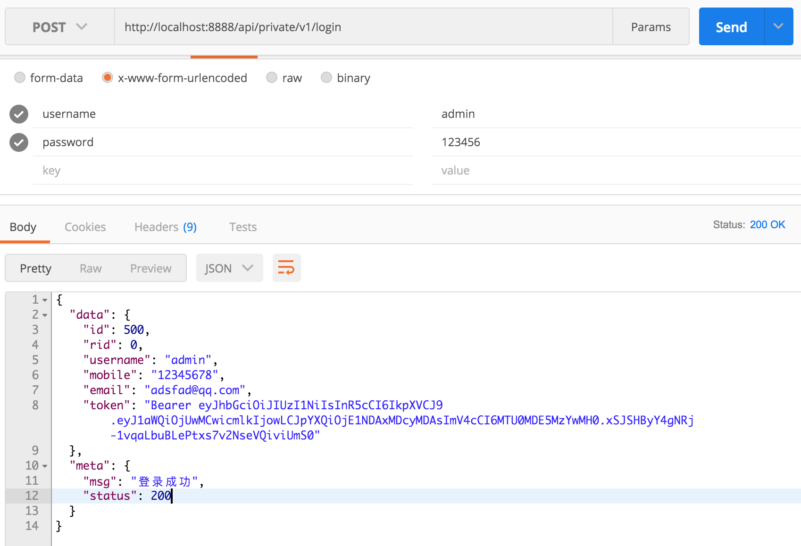


#### 0.3.2 获取用户信息

请求用户列表数据；但是，并没有返回相应的数据；


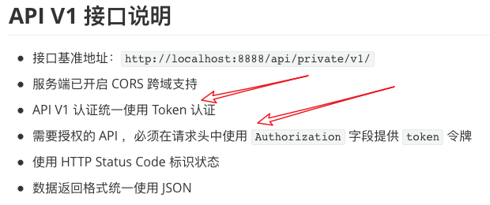


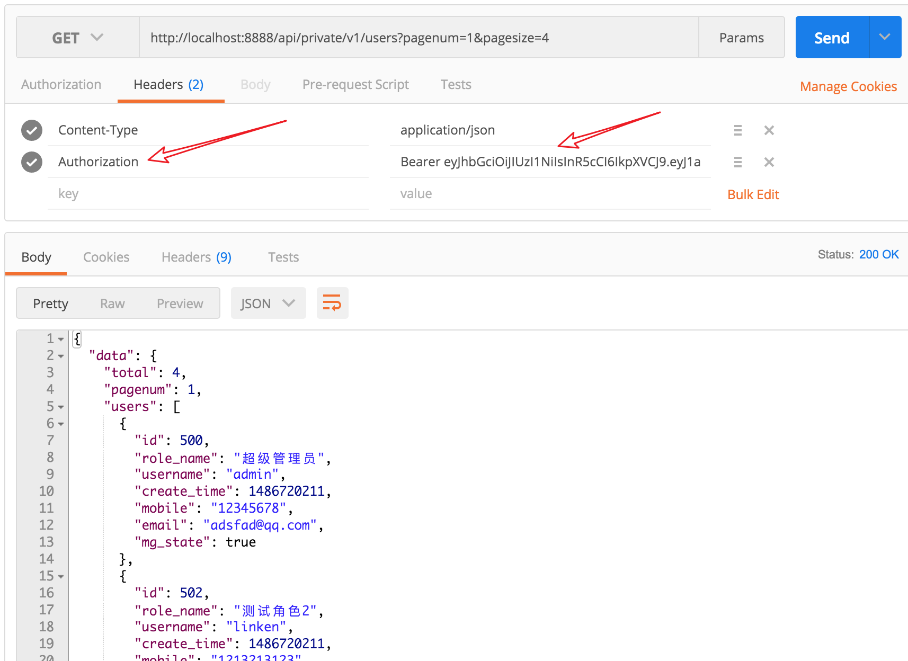


> 使用 token 替换 cookie 的功能


### 0.4 Vue项目初始化

使用 vue-cli 工具初始化项目：


初始化成功，使用 ` npm run dev ` 启动项目；


### 0.5 项目预览

解压 `my-project(Vue项目).rar ` 后进入目录，使用 ` npm run dev ` 启动项目；

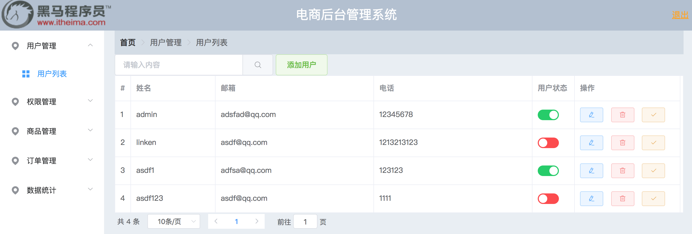


## 第1章 开始项目

### 1.1 添加用户登录路由组件

添加路由：`myapp-code/src/router/index.js`

```js
import Vue from 'vue'
import Router from 'vue-router'
import Login from '@/components/login/login'

Vue.use(Router)

export default new Router({
  routes: [
    {
      path:'/login',
      name:'Login',
      component:Login
    }
  ]
})
```


添加组件：`myapp-code/src/components/login/login.vue`

```vue
<template>
  <div>{{msg}}</div>
</template>

<script>
  export default{
    data(){
      return {msg:'我是登录页面'}
    }
  }
</script>
<style>
</style>

```


修改Vue 项目运行端口： myapp-code/config/index.js  


### 1.2 使用 ElementUI

http://element-cn.eleme.io/#/zh-CN

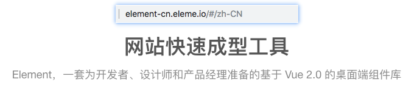


修改 `src/main.js` 代码，全局引入 ElementUI ；

```js
import Vue from 'vue'
import App from './App'
import router from './router'

// 引入 ElementUI 
import ElementUI from 'element-ui'
import 'element-ui/lib/theme-chalk/index.css';
// 将 ElementUI 注册为 vue的全局组件
Vue.use(ElementUI);


Vue.config.productionTip = false

new Vue({
  el: '#app',
  router,
  components: { App },
  template: '<App/>'
})
```


在我们登录页面中尝试一下：` src/components/login/login.vue`

```vue
<template>
  <div>
    <el-button type="success">成功按钮</el-button>
    <el-button type="info">信息按钮</el-button>
    <el-button type="warning">警告按钮</el-button>
    <el-button type="danger">危险按钮</el-button>
  </div>
</template>
```


### 1.3 搭建登录页面

把公共样式写到 `src/assets/css/style.css` ：     ` Form 表单` 

```css
html,
body {
  height: 100%;
}

body {
  margin: 0;
  padding: 0;
}
```

 然后在 `src/main.js` 加载公共样式：

```javascript
// 代码略...

// 引入我们的公共样式
import './assets/css/style.css'

// 代码略...
```

为了让登陆组件的背景色撑满，所以我们需要让他们的父盒子 `div#app` 高度设置为 `100%`。

所以我们在 `src/App.vue` ：

```css
<style>
#app {
  height: 100%;
}
</style>
```

接下来我们开始调整 `src/components/login/login.vue` 组件样式：

- 注意：这里遵循一个原则，不要直接去使用 Element 组件自带的类名
- 如果你想为 Element 组件添加自定义样式，那么建议你给它加你自己的类名来控制


```vue
<template>
<div class="login-wrap">
  <el-form ref="form" :label-position="labelPosition" :model="form" label-width="80px" class="login-from" >
    <h2>用户登录</h2>
    <el-form-item  label="用户名">
    <el-input v-model="form.name"></el-input>
  </el-form-item>
  <el-form-item label-position="top" label="密码">
    <el-input v-model="form.pwd" ></el-input>
  </el-form-item>
  <el-form-item>
    <el-button type="primary" @click="onSubmit" class="login-btn" >登录</el-button>
  </el-form-item>
  </el-form>
  </div>
</template>

<script>
export default {
  data() {
    return {
      labelPosition:'top',
      form: {
        name: "",
        pwd: ""
      }
    };
  },
  methods:{
    onSubmit(){}
  }
};
</script>
```


```css
<style>
.login-wrap {
  background-color: #324152;
  height: 100%;
  display: flex;
  justify-content: center;
  align-items: center;
}

.login-wrap .login-from {
  background-color: #fff;
  width: 400px;
  padding: 30px;
  border-radius: 5px;
}

.login-wrap .login-from .login-btn {
  width: 100%;
}
</style>
```


### 1.4 完成登录功能

#### 1.4.1 封装axios

vue 插件语法： https://cn.vuejs.org/v2/guide/plugins.html

Axios : https://www.kancloud.cn/yunye/axios/234845

`npm install axios` ,将 axios 进行模块化封装，以 Vue 插件的方式，全局引入：

将插件的封装写入 `src/assets/js/myaxios.js` 

```js
// 引入axios
import Axios from 'axios';
// 自定义插件对象
var myaxios = {};
myaxios.install = function(vue){
  // 设置axios请求的URL，此后axios发送的请求全部执行本地址
  var axios_obj = Axios.create({
    baseURL:'http://localhost:8888/api/private/v1/'
  })
  // 将设置好的axios对象赋值给Vue实例的原型
  // 之后可以在Vue中直接只用 this.$myHttp 使用axios发送请求
  vue.prototype.$myHttp = axios_obj;
}
// 将插件以 模块 方式导出
export default myaxios;

```


在 main.js 引入axios插件，并注册为全局插件

```js
// 导入 myaxios 模块
import myaxios from '@/assets/js/myaxios.js'
Vue.use(myaxios) // 注册使用 axios 插件
```


#### 1.4.2 完成登录功能

**发送post请求**

```js
export default {
  data() {
    return {
      labelPosition:'top',
      form: {
        username: "",
        password: ""
      }
    };
  },
  methods:{
    // 修改组件中绑定的按钮名称为 onLogin 
    onLogin(){
      // 使用axios 发送post 请求，传入data中的form数据
      this.$myHttp.post('login',this.form)
      .then(backdata=>{ // 异步执行成功后
        console.log(backdata);
      });
    }
  }
};
```

**继续修改代码，完成登录逻辑**：

vue-router编程式导航： https://router.vuejs.org/zh/guide/essentials/navigation.html

```js
onLogin(){
    // 使用axios 发送post 请求，传入data中的form数据
    this.$myHttp.post('login',this.form)
        .then(backdata=>{ // 异步执行成功后
        //console.log(backdata.data);
        // 结构赋值，获取返回的数据
        var {data,meta}  = backdata.data;
        // 判断数据状态
        if(meta.status == 200){
            alert('登录成功');
            // 使用vue-router编程式导航跳转到home
            this.$router.push('home');
        }
    });
}
```

 

**修改提示弹窗**

```js
var { data, meta } = backdata.data;
// 判断数据状态
if (meta.status == 200) {
    this.$message({
        message: "恭喜你，登录成功",
        type: "success"
    });
    // 使用vue-router编程式导航跳转到home
    this.$router.push("home");
}else{
    this.$message.error('错了哦');
}
```


#### 1.4.3 表单验证

Form 组件提供了表单验证的功能，只需要通过 `rules` 属性传入约定的验证规则，并将 Form-Item 的 `prop` 属性设置为需校验的字段名即可。

```js
data() {
    return {
      labelPosition: "top",
      form: {
        username: "",
        password: ""
      },
      // 与 el-form 中的 :rules="rules"  对应
      rules: {
        //与 el-form-item 中的 prop="username" 对应
        username: [
          // 验证规则  是否必须        提示信息            触发时机
          { required: true, message: "请输入用户名", trigger: "blur" }
        ],
        password: [
          { required: true, message: "请输入密码", trigger: "blur" },
          { min: 3, max: 5, message: "长度在 3 到 5 个字符", trigger: "blur" }
        ]
      }
    };
  },
```


#### 1.4.4 阻止数据提交

```js
onLogin() {
    // 因为要获取form表单的节点对象，
    // 所以 el-form 中要加入 ref="ruleForm" 
    this.$refs.ruleForm.validate(valid => {
        // elementUI 会将 validate 方法加入到节点对象，
        // 在提交是，如果表单的验证未通过，会将错误信息传入回调函数
        if (!valid) {
            // 如果有表单错误信息，则无反应
            this.$message.error("输入有误");
            return;
        }
        // 使用axios 发送post 请求，传入data中的form数据
        this.$myHttp.post("login", this.form).then(backdata => {
            // 结构赋值，获取返回的数据
            var { data, meta } = backdata.data;
            // 判断数据状态
            if (meta.status == 200) {
                this.$message({
                    message: "恭喜你，登录成功",
                    type: "success"
                });
                // 使用vue-router编程式导航跳转到home
                this.$router.push("home");
            } else {
                this.$message.error("错了哦");
            }
        });
    });
}
```


### 1.5 首页

#### 1.5.1 添加路由及页面布局

修改登录成功后逻辑，使用路由名称表示进行跳转：

```js
// 使用vue-router编程式导航跳转到home
this.$router.push({name:"home"});
```


导入组件，添加路由 `src/router/index.js`

```js
import Home from '@/components/home/home'
 ……
{
    path:'/',
    name:'home',
    component:Home
}
```

添加一个home组件`src/components/home/home.vue`

```vue
<template>
  <div>{{msg}}</div>
</template>

<script>
export default {
  data(){
    return{
      msg:'we'
    }
  }
}
</script>
```


修改一个home组件`src/components/home/home.vue `   ` Container 布局容器`

```vue
<template>
<el-container class="height100">
    <el-header>Header</el-header>
    <el-container>
        <el-aside width="200px">Aside</el-aside>
        <el-main>Main</el-main>
    </el-container>
</el-container>
</template>
```


```css

.height100{
    height: 100%;
}
.el-header {
    background-color: #B3C0D1;
    color: #333;
    text-align: center;
    line-height: 60px;
}
.el-aside {
    background-color: #D3DCE6;
    color: #333;
    text-align: center;
    line-height: 200px;
}
.el-main {
    background-color: #E9EEF3;
    color: #333;
    text-align: center;
    line-height: 160px;
}
```


#### 1.5.2 头部样式

`/src/components/home/home.vue`

`Layout 布局`

```vue
<el-header>
    <el-row>
        <el-col :span="6">
            <div class="grid-content bg-purple">
                 
            </div>
        </el-col>
        <el-col :span="12"><div class="grid-content bg-purple-light">电商后台管理系统</div></el-col>
        <el-col :span="6"><div class="grid-content bg-purple"><el-button type="warning">退出</el-button></div></el-col>
    </el-row>
</el-header>


……
// 标题文本样式
.bg-purple-light {
  font-size: 25px;
  color: white;
}
```


#### 1.5.3 左侧样式

`/src/components/home/home.vue`

` NavMenu 导航菜单`  `Icon 图标`

```vue
 <el-container>
    <el-aside width="200px">
      <!-- 
        el-menu 侧边导航栏组件
			unique-opened="true" 只保持一个导航开启
            router="true" 开启导航路由
        el-submenu 导航栏的顶级项
        template 导航栏中需要展示的内容
            i 图标
            span 文字
        el-menu-item-group 次级导航组 内容与导航的组标识 可直接删除
        el-menu-item  导航栏选项

          index属性 控制收起展开+路由标识:
              在el-menu中加入router=“true”属性;
              index="1-1" 点击时路由跳转到1-1 ;
      -->
      <el-menu 
        :unique-opened="true"
        :router="true" 
        default-active="2"
        class="el-menu-vertical-demo"
        @open="handleOpen"
        @close="handleClose">
        <el-submenu index="1" >
          <template slot="title">
            <i class="el-icon-location"></i>
            <span>用户管理</span>
          </template>
          <el-menu-item index="1-1">
            <i class="el-icon-menu"></i>
            用户列表
          </el-menu-item>
        </el-submenu>

        <el-submenu index="2" >
          <template slot="title">
            <i class="el-icon-location"></i>
            <span>权限管理</span>
          </template>
          <el-menu-item index="2-1">
            <i class="el-icon-menu"></i>
            角色列表
          </el-menu-item>
          <el-menu-item index="2-2">
            <i class="el-icon-menu"></i>
            权限列表
          </el-menu-item>
        </el-submenu>
        
      </el-menu>
    </el-aside>
    <el-main>Main</el-main>
  </el-container>
```


我们发现，大部分组件，在浏览器渲染后，都会在标签内部自动添加一个标签名为名字的 class 属性 ，我们可以利用这个属性，设置样式：

```css
.el-menu{
  width: 200px;
  height: 100%
}

.el-submenu{
    text-align: left;
}
```


#### 1.5.4 右侧内容

添加组件内容 `/src/components/home/home.vue`

```vue
<el-main>
    <!-- 路由组件 -->
    <router-view></router-view>
</el-main>
```


添加组件：`src/components/index.vue`

```vue
<template>
  <p>我是首页内容</p>
</template>

<script>
export default {

}
</script>

<style>

</style>

```

添加路由：`/src/router/index.js`

```js
{
    path:'/index',
    name:'index',
    component:Index
}
```


> 注意: 我们希望index.vue 组件的内容,展示到home组件的 <router-view></router-view>中


**知识补充：**

此时，我们需要借助嵌套路由:  https://router.vuejs.org/zh/guide/essentials/nested-routes.html

嵌套路由(子路由的基本用法)：

```html
<script src="./vue.js"></script>
<script src="./vue-router.js"></script>
<div id="app">
    <router-view></router-view>
</div>
<script>
    // 1:定义路由组件
    var login = {
        template: `
            <div>
                <h2>我是登录页面</h2>
                <li><router-link to="/zi">子路由</router-link></li>
                <!--路由组件中继续使用路由组件-->
                <router-view></router-view>
            </div>
            `
    }
    var zi = {
        template: '<h4>我是嵌套路由的组件</h4>'
    }
    // 2:获取路由对象
    var router = new VueRouter({
        // 定义路由规则
        routes: [
            {
                name: 'login',
                path: "/login",
                component: login,
                // 路由中的 children 属性，定义嵌套路由(子路由)
                children: [
                    { name: 'zi', path: "/zi", component: zi }
                ]
            },
        ]
    })

    var app = new Vue({
        el: '#app',
        router
    })
</script>
```


**再谈 代码加载流程 **

```
(main.js->template: '<App/>')替换 (index.html->div#app);

(index.html-><App/>) --> (components: { App })

( components: { App }) --> (import App from './App' -> src/App.vue)

(App.vue -> <router-view/> -> 路由组件) --> (main.js-> router)
========此项决定了页面展示那个组件内容 ========

({path: '/',name: 'HelloWorld', component: HelloWorld }) --> (import HelloWorld from '@/components/HelloWorld')

(src/components/HelloWorld.vue) --> <router-view/>

```


因此，我们需要让 index 成为 home 的子路由组件 `src/router/index.js`

```js
  routes: [
    {
      path:'/login',
      name:'Login',
      component:Login
    },
    {
      path:'/',
      name:'home',
      component:Home,
      // 添加子路由
      children:[
        {path:'index',name:'index',component:Index}
      ]
    },
  ]
```


登录完成后，跳转到 home-->index  `src/components/login/login.vue`

```js
if (meta.status == 200) {
    this.$message({
        message: "恭喜你，登录成功",
        type: "success"
    });
    // 使用vue-router编程式导航跳转到home->index
    this.$router.push({name:"index"});
}
```


### 1.6 验证首页登录

`src/components/login/login.vue`

```js
if (meta.status == 200) {
    this.$message({
        message: "恭喜你，登录成功",
        type: "success"
    });

    // 登录成功后，将token信息保存到 localStorage 
    window.localStorage.setItem('token',data.token);

    // 使用vue-router编程式导航跳转到home->index
    this.$router.push({name:"index"});
}
```


在 `src/components/home/home.vue` 验证登录

```js
export default {
  // 使用生命周期的钩子函数，判断token
  mounted() {
    // 获取token
    var token = window.localStorage.getItem("token");
    if (!token) {
      // 错误提示
      this.$message.error("请登录");
      // 跳转到登录页面
      this.$router.push({ name: "Login" });
    }
  },

  data() {
    return {
      msg: "we"
    };
  }
};
```


### 1.7 用户退出

绑定点击事件

```vue
<el-col :span="6"><div class="grid-content bg-purple"><el-button @click="loginOut" type="warning">退出</el-button></div></el-col>
```

```js
methods:{
    loginOut(){
        // 清楚token
        window.localStorage.removeItem('token')
        // 退出提示
        this.$message({
            message: "您已经退出，继续操作请重新登录",
            type: "success"
        });
        // 页面路由跳转
        this.$router.push({ name: "Login" });
    }
}
```


## 第2章 用户管理

### 2.1 路由及组件

`/src/components/home/home.vue`

```vue
 <el-menu-item index="users">
     <i class="el-icon-menu"></i>
     用户列表
</el-menu-item>
```


`src/router/index.js`

```js
import Users from '@/components/users/users'

……

children:[
    {path:'index',name:'index',component:Index},
    {path:'users',name:'users',component:Users}
]
```


`src/components/users/users.vue`

```vue
<template>
  <div>展示用户列表表格</div>
</template>

<script>
export default {

}
</script>

<style>

</style>

```


### 2.2 面包屑导航及搜索框

`src/components/users/users.vue`   `Card 卡片`     `Breadcrumb 面包屑`  `Input 输入框`  ` Button 按钮`

```vue
<template>
<div>
  <!-- 面包鞋 -->
  <el-card>
  <el-breadcrumb separator-class="el-icon-arrow-right">
    <el-breadcrumb-item :to="{ path: '/index' }">首页</el-breadcrumb-item>
    <el-breadcrumb-item>用户管理</el-breadcrumb-item>
    <el-breadcrumb-item>用户列表</el-breadcrumb-item>
  </el-breadcrumb>
</el-card>

</div>
</template>
```


```vue
……
</el-card>

<el-row>
  <el-col :span="6" class="sou">
    <el-input placeholder="请输入内容" v-model="input5" class="input-with-select">
      <el-button slot="append" icon="el-icon-search"></el-button>
    </el-input>
  </el-col>
  <el-col :span="1" class="sou">
      <el-button type="success" plain>添加用户</el-button>
    </el-col>
</el-row>

</div>

……

<script>
export default {
  data(){
    // 不想看到报错
    return{input5:''}
  }
};
</script>

<style>
.sou{
  line-height:30px
}
</style>
```


### 2.3 展示用户列表

#### 2.3.4 组件展示

`src/components/users/users.vue`  `Table 表格->自定义索引` 

```vue

<!-- 表格 自定义索引 -->
<el-table
    :data="tableData"
    style="width: 100% ;">
    <el-table-column
      type="index"
      :index="indexMethod">
    </el-table-column>
    <el-table-column
      prop="date"
      label="日期"
      width="180">
    </el-table-column>
    <el-table-column
      prop="name"
      label="姓名"
      width="180">
    </el-table-column>
  </el-table>

</div>
</template>

<script>
export default {
  data() {
    return {
      input5:'',
      tableData: [
        {
          date: "2016-05-03",
          name: "王小虎"
        }
      ]
    };
  }
};
</script>
<style>
.sou {
  line-height: 30px;
}

.el-main{
  line-height:30px;
}
</style>
```


#### 2.3.5 获取数据

> 出登录接口，其他接口发送http请求，必须携带token值

Axios : https://www.kancloud.cn/yunye/axios/234845  ---> 请求配置

```js

data() {
    return {
        input5:'',// 不想看到报错
        // 设置页码及条数
        pagenum:1,
        pagesize:5,
        tableData: []
    };
},
// 利用钩子函数，获取数据
mounted() {
    // 获取token
    let token = window.localStorage.getItem('token');
    // 通过配置选项发送请求
    // 携带token
    this.$myHttp({
        // 设置链接地址 es6新语法
        url:`users?pagenum=${this.pagenum}&pagesize=${this.pagesize}`,
        method:'get',
        // 配置token
        headers: {'Authorization': token}
    }).then(res=>{
        // 修改数据  展示页面
        this.tableData = res.data.data.users;
    })
},
```

修改组件参数，展示数据：

`<el-table-column  prop="username"  label="姓名" > </el-table-column>`


#### 2.3.6 操作按钮

`Button 按钮`  `Table 表格->自定义列模板`

```vue
<el-table-column label="操作"  width="210">
      <template slot-scope="scope">
        <el-button type="primary" icon="el-icon-edit" size="mini"  plain></el-button>
        <el-button type="primary" icon="el-icon-check" size="mini"  plain></el-button>
        <el-button type="primary" icon="el-icon-delete" size="mini"  plain></el-button>
      </template>
    </el-table-column>
```

表格中加入按钮等元素时，需要使用 `template` 进行包裹：

```vue
<el-table-column label="用户状态" width="210">
      <template slot-scope="scope">
        <el-switch 
                   v-model="value2" 
                   active-color="#13ce66" 
                   inactive-color="#ff4949">
          </el-switch>
      </template>
</el-table-column>
```


#### 2.3.7 状态显示

而在`template` 标签中有一个 `slot-scope="scope"` 属性，`scope` 的值就是本列中所有数据的值，参考： `Table 表格->固定列`

```vue
<el-table-column label="用户状态" width="210">
      <template slot-scope="scope">
        <!-- 利用scope 中的值，争取显示用户状态 -->
        <el-switch v-model="scope.row.mg_state" active-color="#13ce66"  inactive-color="#ff4949"></el-switch>
        <!-- 测试事件，查看 scope 数据 -->
        <el-button type="primary" size="mini" @click="showScope(scope)">显示scope</el-button>
      </template>
    </el-table-column>
```

```js
methods:{
    // 测试 方法 显示scope
    showScope(scope){
      console.log(scope);
    }
  },
```


#### 2.3.8 分页展示

`Pagination 分页->附加功能`


```vue
 
  <!-- 分页 -->
  <!-- 
      current-page  当前页码数 
      page-sizes  显示条数选项
      page-size 当前每页条数
  -->
  <el-pagination    
      @size-change="handleSizeChange"
      @current-change="handleCurrentChange"
      :current-page="pagenum" 
      :page-sizes="[2, 20, 40]"
      :page-size="pagesize"
      layout="total, sizes, prev, pager, next, jumper"
      :total="total">
    </el-pagination>
</div>
</template>

……
<script>
   ……
data() {
    return {
      input5:'',// 不想看到报错
      
      pagenum:1, //设置页码
      pagesize:2, // 设置页条数
      total:0,  //显示总条数
      
      tableData: []
    };
  },
      ……
      ……
     	// 获取总条数 修改数据展示
        this.total = res.data.data.total;
```


但点击页码时，会触发 `size-change` 事件

```js
<script>
export default {
  data() {
    return {
      input5: "", // 不想看到报错
      pagenum: 1, //设置页码
      pagesize: 2, // 设置页条数
      total: 0, //显示总条数
      tableData: []
    };
  },

  methods: {
    // 获取用户数据
    getUserData() {
      // 获取token
      let token = window.localStorage.getItem("token");
      // 通过配置选项发送请求
      // 携带token
      this.$myHttp({
        // 设置链接地址 es6新语法
        url: `users?pagenum=${this.pagenum}&pagesize=${this.pagesize}`,
        method: "get",
        // 配置token
        headers: { Authorization: token }
      }).then(res => {
        // 修改数据  展示页面
        this.tableData = res.data.data.users;
        // 获取总条数 修改数据展示
        this.total = res.data.data.total;
      });
    },

    // 点击页码触发
    handleCurrentChange(pages) {
        // console.log(pages);
        // 修改data数据，重新发送请求
        this.pagenum = pages;
        this.getUserData();
    },
    // 改变显示条数时触发
    handleSizeChange(numbers){
      this.pagesize = numbers;
      this.getUserData();
    }
  },

  // 利用钩子函数，获取数据
  mounted() {
    this.getUserData();
  }
};
</script>

```


### 2.4 模糊搜索

请求地址中加入 query 请求参数，获取条件结果

```vue
<el-input placeholder="请输入内容" v-model="search" class="input-with-select">
      <el-button slot="append" 
                 @click="searchUsers" 
       icon="el-icon-search"></el-button>
</el-input>

……

<script>
data() {
    return {
      search: "", // 搜索关键字
    };
  },
      
      // 请求地址中加入关键字
      url: `users?pagenum=${this.pagenum}&pagesize=${this.pagesize}&query=${this.search}`,
      
          
      // 点击搜索事件
      searchUsers(){
          this.getUserData();
      }
  </script>
```


### 2.5 切换用户状态

```vue
<!-- 利用scope 中的值，争取显示用户状态 -->
<!-- 组件自带change事件 -->
<el-switch v-model="scope.row.mg_state" @change="change(scope)" active-color="#13ce66"  inactive-color="#ff4949"></el-switch>
```


```js
// Switch 开关 组件自带事件
change(scope){
    // 接受本条全部信息
    // console.log(scope)
    let id = scope.row.id; // 获取id
    var state = scope.row.mg_state; // 获取修改后的状态
    // 请求接口
    this.$myHttp.put(`users/${id}/state/${state}`)
        .then(res=>{
        // 修改失败，将状态改为原始值
        if(!res.data.data){
            this.tableData[scope.$index].mg_state = !state;
            this.$message.error("修改失败");
        }
    })
}
```

修改失败是因为没有token:

```js
// Switch 开关 组件自带事件
change(scope){
    // 接受本条全部信息
    // console.log(scope)
    let id = scope.row.id; // 获取id
    var state = scope.row.mg_state; // 获取修改后的状态
    // 请求接口
    // 需要使用配置参数请求，设置token
    this.$myHttp({
        url:`users/${id}/state/${state}`,
        method:'put',
        headers: { Authorization: window.localStorage.getItem("token") }
    })
        .then(res=>{
        // 修改失败，将状态改为原始值
        if(!res.data.data){
            this.tableData[scope.$index].mg_state = !state;
            this.$message.error("修改失败");
        }
    })
}
```


### 2.6 删除用户

`MessageBox 弹框->确认消息`

```js
// 组件中绑定点击按钮
<el-button type="primary" icon="el-icon-delete" size="mini" @click="deleteUser(scope.row.id)" plain></el-button>


// 删除用户
deleteUser(id) {
    //   this.$myHttp({
    //     url: `users/${id}`,
    //     method: "delete",
    //     headers: { Authorization: window.localStorage.getItem("token") }
    //   }).then(res => {
    //     this.getUserData();
    //     this.$message({
    //       message: "删除成功",
    //       type: "success"
    //     });
    //   });
    this.$confirm("此操作将永久删除该用户, 是否继续?", "提示", {
        confirmButtonText: "确定",
        cancelButtonText: "取消",
        type: "warning"
    })
        .then(() => {
        this.$myHttp({
            url: `users/${id}`,
            method: "delete",
            headers: { Authorization: window.localStorage.getItem("token") }
        }).then(res => {
            this.getUserData();
            this.$message({
                message: "删除成功",
                type: "success"
            });
        });
    })
        .catch(() => {
        this.$message({
            type: "info",
            message: "已取消删除"
        });
    });
}
```


### 2.7 添加用户

`Dialog对话框->自定义内容->打开嵌套表单的 Dialog` ` Form 表单` 

表单弹窗：

```vue
<el-col :span="1" class="sou">
  <!-- 绑定按钮点击事件 直接将 dialogFormVisible值设置为true显示窗口  -->
  <el-button type="success" @click="dialogFormVisible = true" >添加用户</el-button>
  <!-- 
    :visible.sync属性 控制窗口显示隐藏
    -->
  <el-dialog title="收货地址" :visible.sync="dialogFormVisible">
    <el-form :model="form">
      <el-form-item label="活动名称" :label-width="formLabelWidth">
        <el-input v-model="form.name" autocomplete="off"></el-input>
      </el-form-item>
    </el-form>
    <div slot="footer" class="dialog-footer">
      <!-- 点击取消或确定修改dialogFormVisible=false关闭窗口 -->
      <el-button @click="dialogFormVisible = false">取 消</el-button>
      <el-button type="primary" @click="dialogFormVisible = false">确 定</el-button>
    </div>
  </el-dialog>

  </el-col>
</el-row>
```


修改表单

```vue 
<el-col :span="1" class="sou">
  <!-- 绑定按钮点击事件 直接将 dialogFormVisible值设置为true显示窗口  -->
  <el-button type="success" @click="dialogFormVisible = true" >添加用户</el-button>
  <!-- 
    :visible.sync属性 控制窗口显示隐藏
    -->
  <el-dialog title="添加用户" :visible.sync="dialogFormVisible">
    <el-form :model="form">
      <el-form-item label="姓名" label-width="90px">
        <el-input v-model="form.username" ></el-input>
      </el-form-item>
      <el-form-item label="密码" label-width="90px">
        <el-input v-model="form.password" ></el-input>
      </el-form-item>
      <el-form-item label="邮箱" label-width="90px">
        <el-input v-model="form.email" ></el-input>
      </el-form-item>
      <el-form-item label="电话" label-width="90px">
        <el-input v-model="form.mobile" ></el-input>
      </el-form-item>
    </el-form>
    <div slot="footer" class="dialog-footer">
      <!-- 点击取消或确定修改dialogFormVisible=false关闭窗口 -->
      <el-button @click="dialogFormVisible = false">取 消</el-button>
       <!-- 修改点击事件，在数据入库成功后关闭窗口 -->
      <el-button type="primary" @click="addUser">确 定</el-button>
    </div>
  </el-dialog>
</el-col>
```


添加数据及方法

```js
data() {
    return {
      dialogFormVisible: false,
      form: {
        username: '',
        password:'',
        email:'',
        mobile:''

      },
             
……
        
methods 方法
        
 // 添加用户
    addUser(){
      this.$myHttp({
        url:'users',
        method:'post',
        // post数据提交
        data:this.form,
        headers: { Authorization: window.localStorage.getItem("token") }
      }).then(res=>{
          let {data} = res;
          if(data.meta.status == 201){
              // 将数据更新到页面
              this.tableData.push(data.data);
              this.$message({message: "添加用户成功",type: "success"});
              // 关闭窗口 
              this.dialogFormVisible = false
          }
      })
    },
```


### 2.8 修改用户信息

绑定表单事件，传入 scope.row 以显示现有用户数据，做表单读入展示

```vue
<template slot-scope="scope">
        <el-button type="primary" icon="el-icon-edit" size="mini" @click="editUserShow(scope.row)" plain></el-button>
        <el-button type="primary" icon="el-icon-check" size="mini"  plain></el-button>
        <el-button type="primary" icon="el-icon-delete" size="mini" @click="deleteUser(scope.row.id)" plain></el-button>
      </template>
```

添加修改用户信息的弹窗，并在弹窗表单中展示用户信息

```vue 
<!-- 修改用户弹窗 -->
<el-dialog title="添加用户" :visible.sync="editUser">
    <el-form :model="edit">
        <el-form-item label="姓名" label-width="90px">
            <el-input disabled v-model="edit.username" ></el-input>
        </el-form-item>
        <el-form-item label="邮箱" label-width="90px">
            <el-input v-model="edit.email" ></el-input>
        </el-form-item>
        <el-form-item label="电话" label-width="90px">
            <el-input v-model="edit.mobile" ></el-input>
        </el-form-item>
    </el-form>
    <div slot="footer" class="dialog-footer">
        <!-- 点击取消或确定修改dialogFormVisible=false关闭窗口 -->
        <el-button @click="editUser = false">取 消</el-button>
        <el-button type="primary" @click="editUserPut">确 定</el-button>
    </div>
</el-dialog>
```


```js
// 弹窗并显示用户数据 用于修改表单
editUserShow(users){
    this.editUser = true; // 弹窗
    this.edit = users; // 直接使用表单数据
},

// 修改用户信息 入库
editUserPut(){
    var id = this.edit.id;
    var email = this.edit.email;
    var mobile = this.edit.mobile;

    this.$myHttp({
        url: `users/${id}`,
        method: "put",
        data:{email,mobile},
        headers: { Authorization: window.localStorage.getItem("token") }
    }).then(res=>{
        // console.log(res);
        if(res.data.meta.status == 200){
            this.editUser = false; // 关闭窗口
            this.getUserData(); // 重新获取数据
            this.$message({message: "修改用户成功",type: "success"});
        }
    })
}
```


### 2.9 修改用户角色

`Select 选择器->基础用法` 下拉框

```vue
<!-- 分配角色弹窗 -->
<el-dialog title="分配角色" :visible.sync="showRole">
    <el-form :model="role">
        <el-form-item label="当前用户" label-width="90px">
            <el-input disabled v-model="role.username" ></el-input>
        </el-form-item>
        <el-form-item label="活动区域">
            <el-select v-model="roleId"  placeholder="请选择活动区域">
                <el-option
                           v-for="item in roleList"
                           :key="item.key"
                           :label="item.roleName"
                           :value="item.id">
                </el-option>
            </el-select>
        </el-form-item>
    </el-form>
    <div slot="footer" class="dialog-footer">
        {{roleId}}
        <!-- 点击取消或确定修改dialogFormVisible=false关闭窗口 -->
        <el-button @click="showRole = false">取 消</el-button>
        <el-button type="primary" @click="roleUserPut">确 定</el-button>
    </div>
</el-dialog>
```

弹窗后，获取全部角色遍历到 `el-option` ，获取用户id及修改后的角色，请求接口即可；


## 第3章 权限管理

### 3.1 权限列表

添加路由及组件文件

```js
import Rights from '@/components/rights/rights'

{path:'rights',name:'rights',component:Rights}
```


```vue
<template>
  <div>
    <el-table
    height="850"
    ref="singleTable"
    :data="tableData"
    highlight-current-row
    style="width: 100%">
    <el-table-column
      type="index"
      width="50">
    </el-table-column>
    <el-table-column
      property="authName"
      label="权限名称"
      width="120">
    </el-table-column>
    <el-table-column
      property="path"
      label="路径"
      width="120">
    </el-table-column>
    <el-table-column  property="一级"  label="层级">
    </el-table-column>
  </el-table>
  </div>
</template>

<script>
export default {
  data(){
    return {
      tableData:[]
    }
  },
  mounted() {
    this.getlist();
  },
  methods:{
    getlist(){
      this.$myHttp({
        url:'rights/list',
        method:'get',
        headers: { Authorization: window.localStorage.getItem("token") }
      }).then(backs=>{
        // console.log(backs);
        this.tableData = backs.data.data;
      })
    }
  }
}
</script>

<style>
.el-main {
  line-height: 30px;
}
</style>
```

只要在`el-table`元素中定义了`height=500`属性，即可实现固定表头的表格，而不需要额外的代码。


修改层级展示

```vue 
<el-table-column  property="level"  label="层级">
    <template slot-scope="scope">
        <span v-if="scope.row.level==='0'">一级</span>
        <span v-else-if="scope.row.level==='1'">二级</span>
        <span v-if="scope.row.level==='2'">三级</span>
    </template>
</el-table-column>
```


### 3.2 角色列表

添加路由及组件

```js
import Roles from '@/components/roles/roles'

{path:'roles',name:'roles',component:Roles},
```


```vue

<template>
  <el-table :data="tableData5"  style="width: 100%">

    <!-- 折叠内容 -->
    <el-table-column type="expand">
      <template slot-scope="props">
        <el-form label-position="left" inline class="demo-table-expand">
          <el-form-item label="商品名称">
            <span>{{ props.row.name }}</span>
          </el-form-item>
          <el-form-item label="所属店铺">
            <span>{{ props.row.shop }}</span>
          </el-form-item>
        </el-form>
      </template>
    </el-table-column>


    <!-- 表头及折叠按钮 -->
    <el-table-column
      label="角色名称"
      prop="id">
    </el-table-column>
    <el-table-column
      label="角色描述"
      prop="name">
    </el-table-column>
    <el-table-column
      label="操作"
      prop="desc">
    </el-table-column>

  </el-table>
</template>

<script>
  export default {
    data() {
      return {
        tableData5: [{
          id: '12987122',
          name: '好滋好味鸡蛋仔',
          category: '江浙小吃、小吃零食',
          desc: '荷兰优质淡奶，奶香浓而不腻',
          address: '上海市普陀区真北路',
          shop: '王小虎夫妻店',
          shopId: '10333'
        }, {
          id: '12987123',
          name: '好滋好味鸡蛋仔',
          category: '江浙小吃、小吃零食',
          desc: '荷兰优质淡奶，奶香浓而不腻',
          address: '上海市普陀区真北路',
          shop: '王小虎夫妻店',
          shopId: '10333'
        }]
      }
    }
  }
</script>

<style>
  .demo-table-expand {
    font-size: 0;
  }
  .demo-table-expand label {
    width: 90px;
    color: #99a9bf;
  }
  .demo-table-expand .el-form-item {
    margin-right: 0;
    margin-bottom: 0;
    width: 50%;
  }
  .el-main{
    line-height:20px;
  }
</style>
```


```vue
<!-- 表头及折叠按钮 -->
<el-table-column
                 label="角色名称"
                 prop="roleName">
</el-table-column>
<el-table-column
                 label="角色描述"
                 prop="roleDesc">
</el-table-column>
<el-table-column
                 label="操作"
                 prop="desc">
    <template slot-scope="scope">
        <el-button type="primary" icon="el-icon-edit" size="mini" circle></el-button>
        <el-button type="success" icon="el-icon-check" size="mini" circle></el-button>
    </template>
</el-table-column>
```

```js
  data() {
    return {
      roleList: []
    };
  },
  mounted() {
    this.getrolelist();
  },
  methods: {
    getrolelist() {
      this.$myHttp({
        url: "roles",
        method: "get"
      }).then(back => {
        this.roleList = back.data.data;
      });
    }
  }
```

 `Tag 标签->可移除标签`

```vue
<!-- 折叠内容 -->
<el-table-column type="expand">
    <template slot-scope="props">
	<el-tag closable>可移除</el-tag>
    </template>
</el-table-column>
```


分析角色数据，`children` 为上级角色中的子级角色；

```vue
<!-- 折叠内容 -->
<el-table-column type="expand">
    <template slot-scope="scope">
	{{scope.row.children}}
	<!-- <el-tag closable>{{scope.row.children}} </el-tag> -->
    </template>
</el-table-column>
```


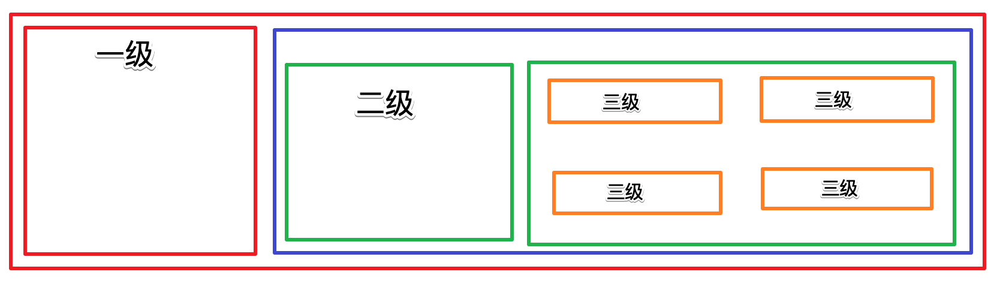


```vue
<!-- 折叠内容 -->
    <el-table-column type="expand">
      <template slot-scope="scope">
        <!-- Layout 布局 -->
        <el-row>
          <!-- 一级区域 -->
          <el-col :span="6">
            <!-- 一级内容展示 -->
            <el-tag closable>{{scope.row.children[1].authName}} </el-tag> >
          </el-col>
          
          <el-col :span="18">
            <!-- 二级区域 -->
            <el-row>
              <el-col :span="6">
                  <!-- 二级内容 -->
                  <el-tag closable type="success">{{scope.row.children[0].children[0].authName}} </el-tag> >
              </el-col>
              <el-col :span="18">
                  <!-- 三级内容 -->
                  <el-tag closable type="warning">{{scope.row.children[1].children[0].children[0].authName}}</el-tag>
                  <el-tag closable type="warning">{{scope.row.children[1].children[0].children[1].authName}}</el-tag>
                  <el-tag closable type="warning">{{scope.row.children[1].children[0].children[2].authName}}</el-tag>
              </el-col>
            </el-row>
          </el-col>
        </el-row>
      </template>
    </el-table-column>
```


循环遍历所有层级角色

```vue
  <!-- 折叠内容 -->
    <el-table-column type="expand">
      <template slot-scope="scope">
        <!-- Layout 布局 -->
        <el-row class="rowmargin" v-for="item1 in scope.row.children" :key="item1.id">
          <!-- 一级区域 -->
          <el-col :span="6">
            <!-- 一级内容展示 -->
            <el-tag closable>{{item1.authName}} </el-tag> >
          </el-col>
          
          <el-col :span="18">
            <!-- 二级区域 -->
            <el-row  v-for="item2 in item1.children" :key="item2.id">
              <el-col :span="6">
                  <!-- 二级内容 -->
                  <el-tag closable type="success">{{item2.authName}} </el-tag> >
              </el-col>
              <el-col :span="18">
                  <!-- 三级内容 -->
                  <el-tag v-for="item3 in item2.children" :key="item3.id" closable type="warning">{{item3.authName}} </el-tag>
              </el-col>
            </el-row>
          </el-col>
        </el-row>
	
		<!-- 判断没有权限 -->
	    <el-row v-if="scope.row.children.length==0">
          <template><el-tag type="danger">木有权限</el-tag></template>
        </el-row>	

      </template>
    </el-table-column>


……

.el-tag{
  margin-top: 10px;
  margin-right:5px; 
}
<style>
```


### 3.3 删除角色权限

绑定close事件

页面元素删除

```vue 
<!-- 三级内容 -->
<el-tag @close="closeTag(item2,key3)"  v-for="(item3,key3) in item2.children" :key="item3.id" closable type="warning">{{item3.authName}} </el-tag>
```


```js
// 删除角色权限
closeTag(item,key){
    // 数组引用传递，直接删除即可
    // console.log(item,key)
    item.children.splice(key,1);
}
```

 

服务器删除

```vue
<el-col :span="18">
<!-- 三级内容 -->
<el-tag @close="closeTag(item2,key3,scope.row.id,item3.id)"  v-for="(item3,key3) in item2.children" :key="item3.id" closable type="warning">{{item3.authName}} </el-tag>
</el-col>
```


```js
// 删除角色权限
closeTag(item,key,roleId,rightId){
    // item 要删除元素所在父级数组
    // key 要删除元素所在父级数组下标
    item.children.splice(key,1);

    // roleid 角色ID，rightId权限ID
    // console.log(roleId,rightId);
    this.$myHttp({
        url:`roles/${roleId}/rights/${rightId}`,
        method:'delete'
    }).then(back=>{
        let {meta}  = back.data;
        // console.log(meta);
        if(meta.status == 200){
            this.$message({message:meta.msg,type:'success'});
        }
    })
}
```


### 3.4 修改角色权限

展示面板：

```vue
<template slot-scope="scope">
            <el-button type="primary" icon="el-icon-edit" size="mini" circle></el-button>
            <el-button type="success" icon="el-icon-check" size="mini" @click="rightsShow" circle></el-button>
        </template>
```


```vue
<!-- 修改角色授权面板 -->
<el-dialog title="修改角色权限" :visible.sync="isrightsShow">
    <div slot="footer" class="dialog-footer">
        <el-tree show-checkbox="true" :data="rightsList" :props="defaultProps" ></el-tree>
        <!-- 点击取消或确定修改dialogFormVisible=false关闭窗口 -->
        <el-button @click="isrightsShow = false">取 消</el-button>
        <el-button type="primary" @click="rightsPut">确 定</el-button>
    </div>
</el-dialog>
```


```js
return {
    // 所有权限列表
    rightsList:[],
    // 设置展示内容
    defaultProps: {
        children: 'children',
        label: 'authName'
    },
```


```js
// 展示修改角色权限面板
rightsShow() {
    // 获取所有角色权限
    this.$myHttp({
        url:'rights/tree',
        method:'get'
    }).then(back=>{
        let {data,meta} = back.data;
        this.rightsList= data;
    })
    this.isrightsShow = true;
},
```


选中角色拥有的权限：

在点击按钮式，将所有角色的所有信息传入展示面板事件中：

```vue
<template slot-scope="scope">
    <el-button type="primary" icon="el-icon-edit" size="mini" circle></el-button>
    <el-button @click="rightsShow(scope.row)" type="success" icon="el-icon-check" size="mini" circle></el-button>
</template>
```


```vue
    <!-- 修改角色授权面板 -->
    <el-dialog title="修改角色权限" :visible.sync="isrightsShow">
      <div slot="footer" class="dialog-footer">
        <!-- 
		  default-expand-all 默认展开所有节点
          node-key="id" 将id设置为节点的唯一主键
          :default-checked-keys=[] 被选中主键的数组
          :props="defaultProps" 设置显示的内容			
		  show-checkbox 节点可被选中
          -->
        <el-tree 
            default-expand-all
            node-key="id"  
            :default-checked-keys="defaultChecked"
            show-checkbox
            :data="rightsList" 
            :props="defaultProps" ></el-tree>
        <!-- 点击取消或确定修改dialogFormVisible=false关闭窗口 -->
        <el-button @click="isrightsShow = false">取 消</el-button>
        <el-button type="primary" @click="rightsPut">确 定</el-button>
      </div>
    </el-dialog>
```


```js
data() {
    return {
      // 所有权限列表
      rightsList: [],
      // 设置展示内容
      defaultProps: {
        children: "children",
        label: "authName"
      },
      // 默认选中的节点数组
      defaultChecked: [],

      // 控制角色权限面板
      isrightsShow: false,

      // 所有角色数据列表
      roleList: []
    };
  },  

…… 

// 展示修改角色权限面板
      rightsShow(row) {
          // 获取所有角色权限
          this.$myHttp({
              url: "rights/tree",
              method: "get"
          }).then(back => {
              let { data, meta } = back.data;
              // 显示所有权限
              this.rightsList = data;
          });

          // 遍历row,获取当前角色选中的所有权限，写入数组
          this.defaultChecked = [];
          // 在遍历赋值前，先清空数据，以免受其他数据影响
          var rr = row.children;
          rr.forEach(item1 => {
              item1.children.forEach(item2=>{
                  item2.children.forEach(item3=>{
                      // 只获取第三季选中即可
                      this.defaultChecked.push(item3.id);
                  })
              });
          });

          console.log(this.defaultChecked);
          // 控制显示窗口
          this.isrightsShow = true;
      },
```


提交数据入库：

```js
    // 提交修改角色权限
    rightsPut() {
      // 在树形控件 中添加 ref="tree" 的属性，在此使用
      // elUI 中提供两个方法getCheckedKeys、getHalfCheckedKeys
      // 获取已选中的节点key 
      var arr1 = this.$refs.tree.getCheckedKeys();
      var arr2 = this.$refs.tree.getHalfCheckedKeys();
      // concat() 合并两个数组的元素
      // join() 将数组的值以逗号隔开转为字符串
      var checkedKeys = arr1.concat(arr2).join();
      this.$myHttp({
        // 点击打开窗口是，保存角色id,在此获取使用
        url:`roles/${this.roleId}/rights`,
        method:'post',
        data:{rids:checkedKeys}
      }).then(back=>{
        let {data,meta} = back.data;
        if(meta.status == 200){
          this.isrightsShow = false; // 关闭窗口
          this.getrolelist(); // 刷新数据
          this.$message({message:meta.msg,type:'success'}); // 提示成功
        }
      })
    },
```


### 3.5 权限限制

对角色分配了权限后，我们并没有做限制，其实接口文档中`左侧菜单权限` 已经提供了相应的接口：

`src/components/home/home.vue`

```vue
<el-menu 
        unique-opened
        :router="true"
        class="el-menu-vertical-demo"
        >
    <el-submenu 
                v-for="item in menusList" 
                :key="item.id" 
                :index="item.id.toString()" >
            <template slot="title">
            <i class="el-icon-location"></i>
            <span>{{item.authName}} {{item.id}}</span>
            </template>
        <el-menu-item 
                      v-for="item2 in item.children" 
                      :key="item2.id"  
                      :index="item2.path">
            <i class="el-icon-menu"></i>
            {{item2.authName}}  {{item2.path}}
        </el-menu-item>
    </el-submenu>
</el-menu>

<script>
export default {
  // 使用生命周期的钩子函数，判断token
  mounted() {
    // 获取token
    var token = window.localStorage.getItem("token");
    if (!token) {
      // 错误提示
      this.$message.error("请登录");
      // 跳转到登录页面
      this.$router.push({ name: "Login" });
    }else{
      // 登录后，获取左侧菜单权限
      this.$myHttp({
        url:'menus',
        method:'get',
      }).then(back=>{
        let {data,meta} = back.data;
        if(meta.status == 200){
          console.log(data);
          this.menusList = data
        }
      })
    }

  },

  data() {
    return {
      menusList:[],
      msg: "we"
    };
  },
  methods:{
    loginOut(){
      window.localStorage.removeItem('token')
      this.$message({
              message: "您已经退出，继续操作请重新登录",
              type: "success"
            });
      this.$router.push({ name: "Login" });
    }
  }
};
</script>
```


### 3.6 导航守卫

导航守卫: https://router.vuejs.org/zh/guide/advanced/navigation-guards.html

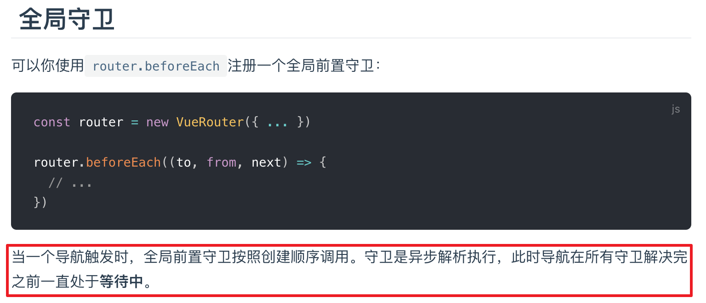


```js
var router = new Router({……})

// 配置路由的导航守卫
router.beforeEach((to, from, next) => {
  // 如果访问登录的路由地址，放过
  if (to.name === 'Login') {
    next();
  } else {
    // 如果请求的不是登录页面，验证token
    // 1. 获取本地存储中的token
    const token = localStorage.getItem('token');
    if (!token) {
      // 2. 如果没有token，跳转到登录
      next({
        name: 'Login'
      });
    } else {
      // 3. 如果有token，继续往下执行
      next();
    }
  }
});

export default router;
```


## 第99章 项目打包及加载优化

打包命令：`npm run build`  

打包完成后，直接将dist文件夹内容复制到服务器根目录即可；

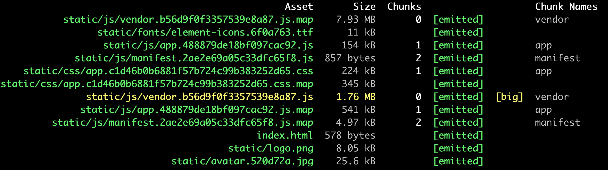


我们的项目是很多组件组成的页面，但是，每次发送请求不管请求的是哪个路由的那个组件，很明显的都会将所有内容一次性全部加载出来，影响网站加载速度；如果我们可以在用户请求不同路由时，根据请求加载不同的页面，就会很大程度上提高页面的加载速度；

路由懒加载： https://router.vuejs.org/zh/guide/advanced/lazy-loading.html


路由懒加载的工作就是在打包时，将路由文件分离出来，在请求时，需要哪个路由，再去请求相关文件；

用法：将路由引入的组件分别打包到不同的 js 文件；

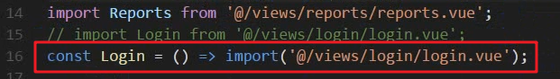


打包完成后，很明显的在 JS 文件夹中多了一个js文件；

然后我们可以将所有的组件全部改为路由懒加载模式：

```js
const Login = () => import('@/components/login/login');
const Home = () => import('@/components/home/home');
const UserList = () => import('@/components/userlist/user-list');
const RoleList = () => import('@/components/rolelist/role-list');
const RightsList = () => import('@/components/rightslist/rights-list');
const GoodsList = () => import('@/components/goodslist/goods-list');
const GoodsCategories = () => import('@/components/goodscategories/goods-categories');
const GoodsAdd = () => import('@/components/goodsadd/goods-add');
const Report = () => import('@/components/report/report');
const Order = () => import('@/components/orders/orders');
const Params = () => import('@/components/params/params');
```


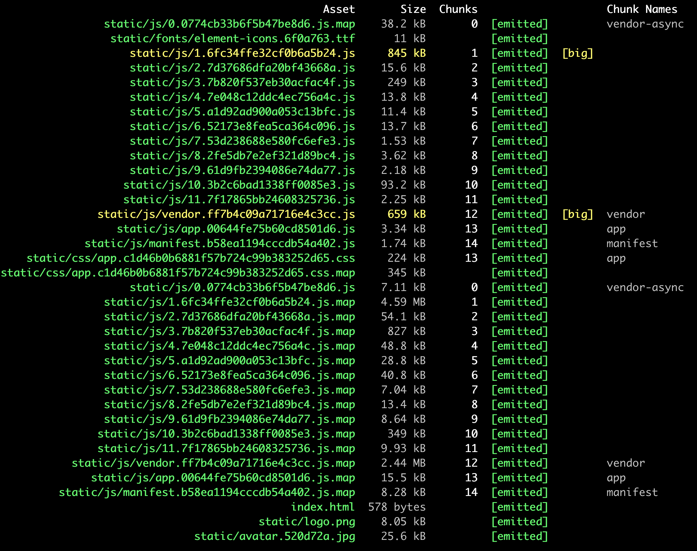


但这是不够的，我们知道，很多组件都是可以用 CDN 加载的；

1：找到 cdn 地址，直接在index.html 中加入地址，注意，cdn 引入版本要和项目中的版本保持一致；

```html
 <body>
    <div id="app">
    </div>
    <script src="https://cdn.bootcss.com/vue/2.5.2/vue.min.js"></script>
    <!-- built files will be auto injected -->
  </body>
```

2：修改 webpack 配置文件  https://www.webpackjs.com/configuration/externals/

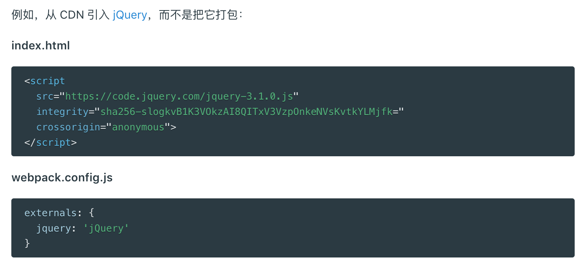


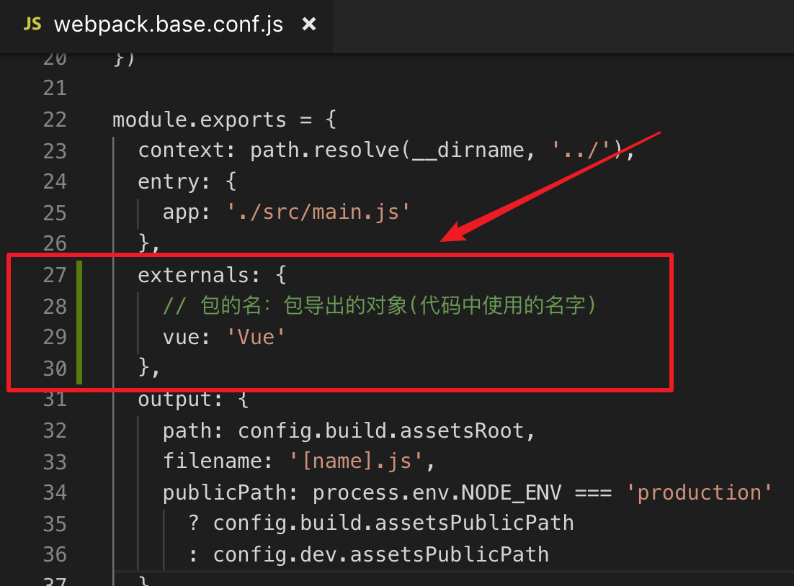


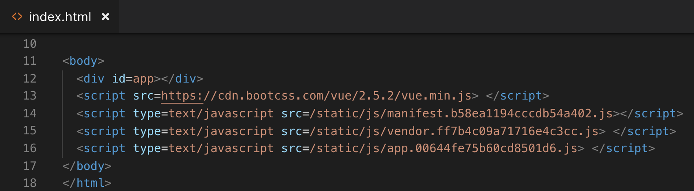


.西岭老湿